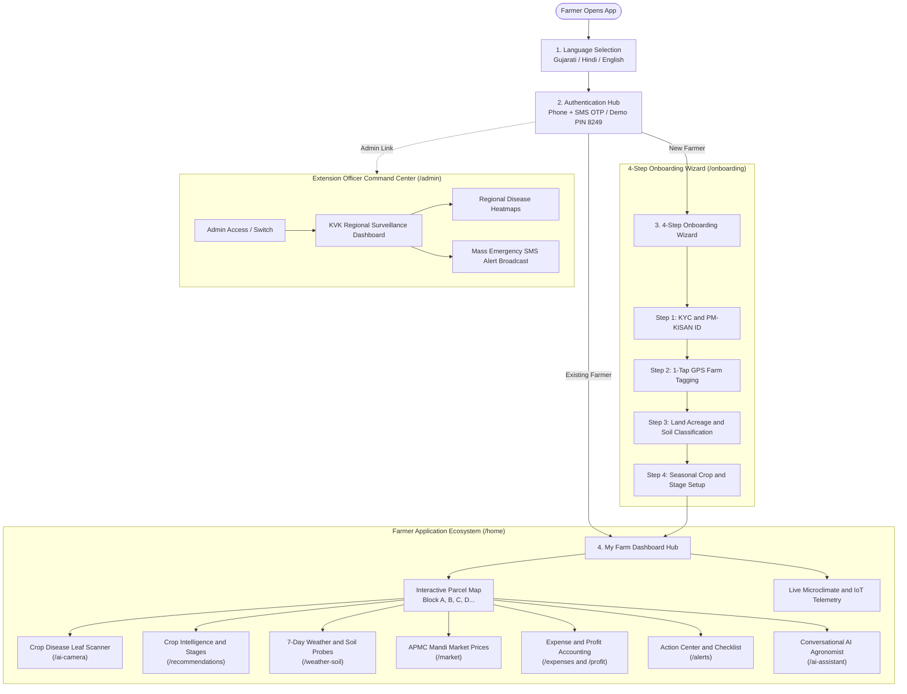
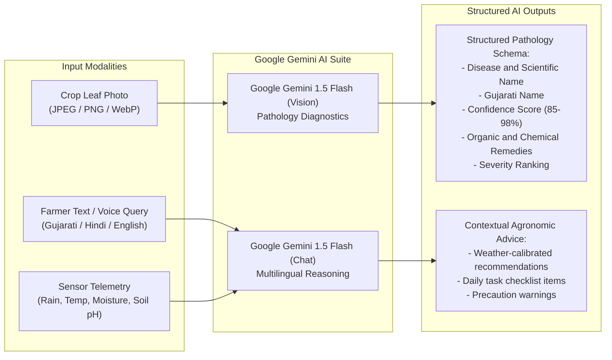
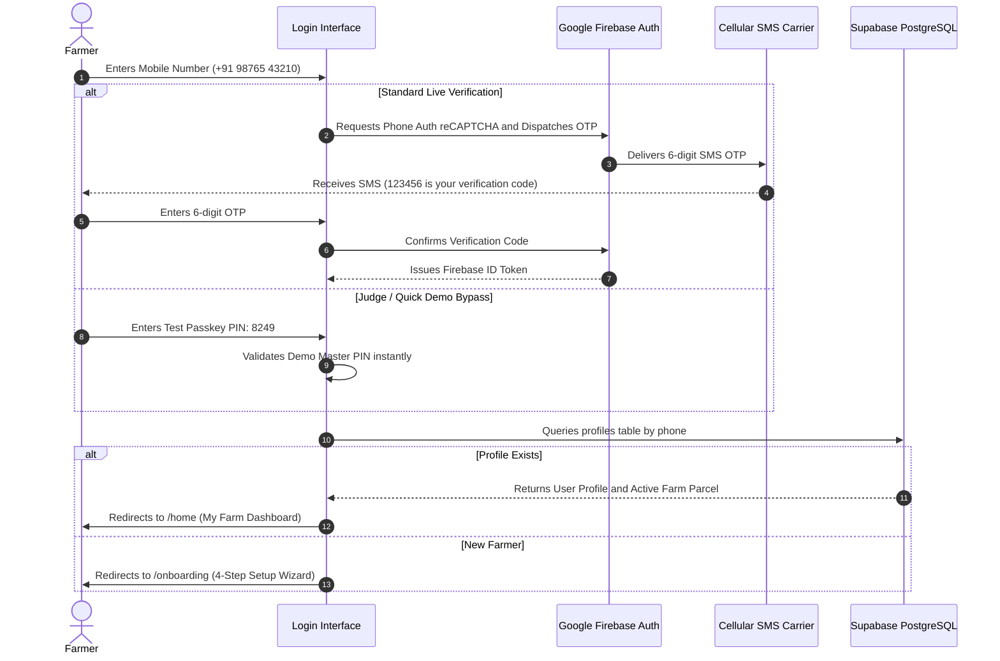
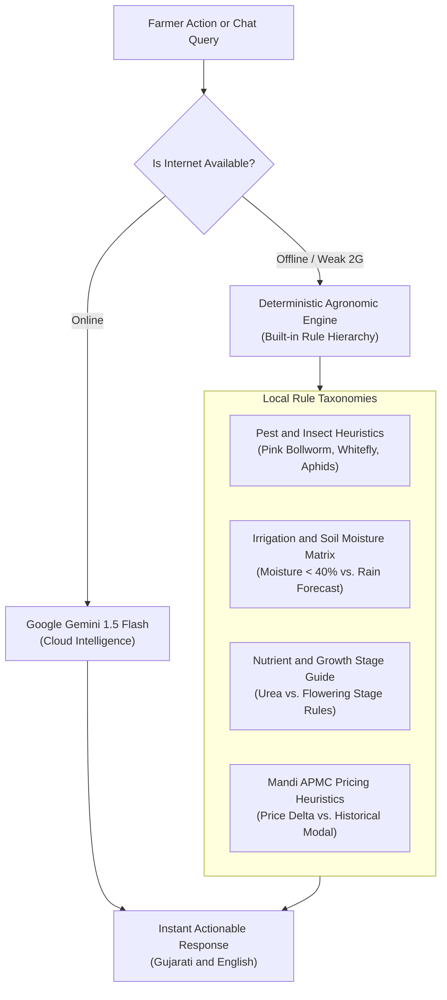
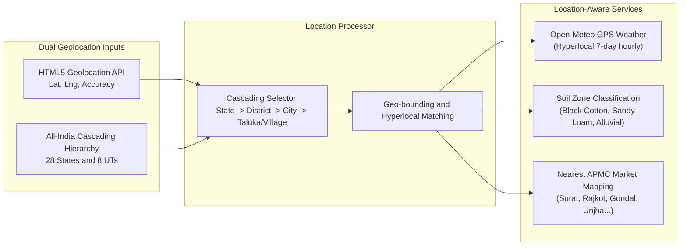
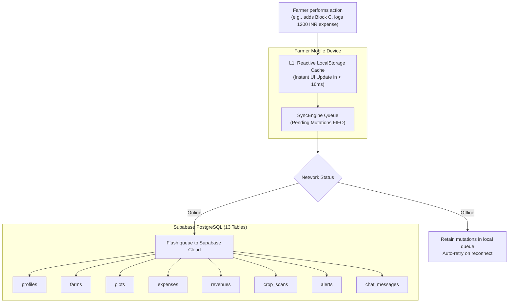

# AgroMind AI — Application Structure and Technical Specification
> **Comprehensive Guide to App Flow, AI Models, Authentication, Heuristic Engines, and Geolocation**  
> *Designed for Evaluators, Judges, and Developers — Bit N Build '26 Gujarat*
> **Looking for the main project pitch, problem statement & quick start?** See the primary [README.md](./README.md).

---

## Document Overview

This document provides a structured explanation of the core technical pillars powering **AgroMind AI**:
1. [1. Complete Application Flow and Feature Journey](#1-complete-application-flow-and-feature-journey)
2. [2. AI Models and Vision Architecture](#2-ai-models-and-vision-architecture)
3. [3. Authentication and Session Security](#3-authentication-and-session-security)
4. [4. Trained Knowledge and Deterministic Agronomic Engines](#4-trained-knowledge-and-deterministic-agronomic-engines)
5. [5. Geolocation and All-India Administrative Hierarchy](#5-geolocation-and-all-india-administrative-hierarchy)
6. [6. Cloud Database and Offline-First Sync Architecture](#6-cloud-database-and-offline-first-sync-architecture)
7. [7. Complete Feature-by-Feature Matrix](#7-complete-feature-by-feature-matrix)

---

## 1. Complete Application Flow and Feature Journey

AgroMind AI guides a farmer through a logical, sequential path from identity verification to automated field interventions:



### Step-by-Step User Journey:
1. **Welcome and Localization (`/`)**: Farmer chooses their preferred language (**Gujarati**, **Hindi**, or **English**). The selection immediately adapts all terminology and formatting.
2. **Unified Authentication (`/login`)**: Farmer enters their 10-digit mobile number. Firebase Phone Auth sends a real 6-digit SMS OTP (or evaluators can enter instant bypass PIN `8249`).
3. **Onboarding Wizard (`/onboarding`)**: First-time users map their farm in under 60 seconds across 4 guided cards:
   - *Card 1*: Full Name, PM-KISAN Beneficiary ID, and Cascading Location.
   - *Card 2*: One-click GPS location tagging via device sensors.
   - *Card 3*: Farm acreage, ownership type, soil class, and irrigation method.
   - *Card 4*: Active Kharif/Rabi crops (Cotton, Groundnut, Wheat, etc.).
4. **My Farm Dashboard (`/home`)**: The primary command deck featuring:
   - 4 Vital Telemetry Chips: Total Land, Soil Classification, Irrigation Source, and Sentinel-2 Satellite NDVI.
   - **Interactive Parcel Map**: Displays dynamic plot blocks (`Block A`, `Block B`, `Block C`...) with individual crop stages, soil moisture, and active status indicators.
   - Real-time weather banner with automated advisory triggers.
5. **Crop Leaf Disease Scanner (`/ai-camera`)**: Farmer captures or uploads an infected leaf photo for instant AI pathology diagnosis.
6. **Mandi Market Rates (`/market`)**: Real-time prices across major APMC markets in Gujarat and India, with trend graphs and "Sell vs. Store" recommendations.
7. **Expense and Profit Accounting (`/expenses`, `/profit`)**: Simple digital ledger tracking seeds, fertilizer, machinery, and labor costs to calculate the farmer's **Break-Even Price** and expected net profit.
8. **Action Center Checklist (`/alerts`)**: Prioritized to-do list generated automatically from weather alerts, soil readings, and disease scans.
9. **AI Agronomist Chat (`/ai-assistant`)**: Multilingual assistant providing contextual guidance tailored to the farmer's active farm profile.
10. **KVK Agronomist Command Center (`/admin`)**: Dedicated portal for Krishi Vigyan Kendra officers to inspect district-wide telemetry, spot disease outbreaks, and broadcast emergency advisories.

---

## 2. AI Models and Vision Architecture

AgroMind AI employs a **hybrid intelligence approach**: cloud-scale Foundation Models for complex vision and conversational tasks, backed by deterministic rule engines for offline resilience.



### 1. Vision Model: `gemini-1.5-flash`
- **Purpose**: Real-time crop leaf pathology diagnosis and pest damage assessment.
- **Why Gemini 1.5 Flash?**: Low latency (< 1.8 seconds), native multimodal token processing, high precision on plant pathology, and cost-effective token consumption.
- **Data Pipeline**:
  1. Image captured via HTML5 Camera API (`<input capture="environment" accept="image/*">`).
  2. Client-side canvas compression down to $< 4$ MB.
  3. Dispatched to the secure edge proxy (`supabase/functions/diagnose-leaf/index.ts`) with client rate limiting (30 requests/min).
  4. Formatted as multimodal base64 payload into Gemini's `inline_data`.
  5. Enforces a strict, typed JSON response schema:
     ```json
     {
       "diseaseName": "Early Leaf Spot (Cercospora arachidicola)",
       "diseaseGu": "સર્કોસ્પોરા પાન ટપકાં રોગ",
       "scientificName": "Cercospora arachidicola",
       "confidence": 93,
       "severity": "Moderate",
       "symptoms": ["Brown circular lesions with yellow chlorotic halos"],
       "remedies": [
         { "type": "Organic / જૈવિક", "action": "Neem Oil 1500 PPM", "dosage": "5 ml/L water" },
         { "type": "Chemical / રાસાયણિક", "action": "Mancozeb 75% WP", "dosage": "2.5 g/L water" }
       ],
       "warning": "Avoid spraying if rain is expected within 6 hours"
     }
     ```

### 2. Conversational Model: `gemini-1.5-flash` (Agro-Chat)
- **Purpose**: Conversational agronomist answering farmer inquiries in Gujarati, Hindi, and English.
- **Contextual Prompt Injection**: Each query is dynamically injected with the farmer's real-time state:
  - Active crops (`Shankar-6 Cotton`, `GG-20 Groundnut`)
  - Growth stage (`Flowering - Day 54`)
  - Current soil moisture (`68% Optimal`)
  - 48-hour rainfall probability from Open-Meteo (`75% Rain Tomorrow`)
  - APMC Mandi rates (`Surat APMC: ₹7,250/Qtl`)

---

## 3. Authentication and Session Security



### Security Details:
- **Phone Telephony**: Powered by **Google Firebase Phone Authentication** supporting real SMS delivery across all Indian carriers.
- **Judge Bypass Mechanism**: Built-in master passkey PIN **`8249`** allows hackathon evaluators to test login and onboarding without cellular SMS latency.
- **Session Architecture**:
  - JWT tokens cached in reactive local storage.
  - Role-based routing separating `farmer` from `admin` (KVK extension officer).
  - Protected routes enforced by React Router layout wrappers (`FarmerLayout`).

---

## 4. Trained Knowledge and Deterministic Agronomic Engines

To ensure AgroMind AI operates reliably even when cellular networks fail completely in remote agricultural zones, the platform includes a **Deterministic Agronomic Reasoning Engine**:



### Built-in Knowledge Taxonomies:
1. **Pest and Pathogen Heuristics**:
   - *Pink Bollworm in Cotton*: Detects keyword triggers -> prescribes Gossyplure pheromone traps (5/acre) and Emamectin Benzoate 5% SG @ 5g/10L.
   - *Tikka Disease in Groundnut*: Identifies leaf spot symptoms -> recommends Mancozeb 75% WP or Chlorothalonil 75% WP.
2. **Moisture and Irrigation Thresholds**:
   - Soil moisture $> 70\%$ + rain forecasted within 48h -> **Action**: *"Postpone drip irrigation for 24-48 hours to avoid root rot."*
   - Soil moisture $< 35\%$ during flowering stage -> **Action**: *"Critical moisture stress detected. Run micro-drip cycle tomorrow 06:30 AM."*
3. **Fertilizer Dosage and Stage Timing**:
   - Sowing stage -> Basal application of DAP and Potash.
   - Vegetative to Flowering stage -> Split-dose Urea application, strictly withholding nitrogen within 36 hours of forecasted rainfall.

---

## 5. Geolocation and All-India Administrative Hierarchy

Agricultural recommendations are only useful if they understand the farmer's precise microclimate and soil zone.



### 1. High-Precision GPS Tagging
- Uses the browser's native `navigator.geolocation` API with `enableHighAccuracy: true`.
- Automatically captures Latitude, Longitude, and GPS Accuracy radius in meters without manual coordinate typing.

### 2. All-India Cascading Geographic Hierarchy (`src/data/indiaGeoData.ts`)
- **28 States and 8 Union Territories** included in a structured cascading tree.
- **Deep Gujarat Coverage**: All 33 districts mapped with their corresponding cities, talukas, and primary village clusters:
  - *Surat* -> Kamrej, Olpad, Bardoli, Mandvi, Mangrol...
  - *Rajkot* -> Gondal, Jetpur, Dhoraji, Jasdan, Kotda Sangani...
  - *Ahmedabad* -> Sanand, Dholka, Bavla, Viramgam, Mandal...
  - *Junagadh*, *Vadodara*, *Bhavnagar*, *Amreli*, *Kutch* and all remaining districts.
- Allows custom manual village typing if a farmer lives in a remote unlisted hamlet.

---

## 6. Cloud Database and Offline-First Sync Architecture

AgroMind AI features a **two-tier storage architecture**: zero-latency local caching (L1) with an asynchronous reconciliation queue (`SyncEngine`) syncing to **Supabase PostgreSQL** (L2).



### The 13 Relational Database Tables:
1. `profiles`: Farmer identities, phone numbers, PM-KISAN IDs, language preference, and KYC verification flags.
2. `farms`: Primary farm parcels, total/cultivable area, survey numbers, soil types, and water sources.
3. `plots`: Sub-divided plots (`Block A`, `Block B`, `Block C`...) with individual crops, stages, and acreage.
4. `crops`: Supported crop varieties (Shankar-6 Cotton, GG-20 Groundnut, GW-496 Wheat) with lifecycle timelines.
5. `expenses`: Input cost ledger entries (seeds, fertilizer, machinery, labor, electricity).
6. `revenues`: Harvest sales and income ledger entries.
7. `diagnoses`: AI pathology records, disease names, confidence scores, and remedy recommendations.
8. `crop_scans`: Raw image metadata and audit trails of leaf scans.
9. `alerts`: Urgent agro-advisories, weather warnings, and pest notifications.
10. `mandi_prices`: Daily APMC commodity prices, modal rates, and market trends.
11. `chat_messages`: Multilingual AI assistant conversation history.
12. `user_preferences`: Farmer notification preferences (SMS, WhatsApp, audio voice assistance).
13. `sync_queue`: Background offline mutation queue tracking pending cloud synchronization items.

---

## 7. Complete Feature-by-Feature Matrix

| Feature Module | Route | Primary API / Model Used | Data Inputs | Output to Farmer |
|---|---|---|---|---|
| **Language Selection** | `/` | Internal i18n Engine | User touch selection | Instant interface re-render in Gujarati, Hindi, or English |
| **Authentication** | `/login` | Firebase Phone Auth | 10-digit phone number, 6-digit SMS OTP (or Demo PIN `8249`) | Verified session token + profile record |
| **4-Step Onboarding** | `/onboarding` | HTML5 Geolocation + India Geo Dataset | GPS coordinates, farm acreage, soil type, crop choice | Registered farm parcel in database |
| **My Farm Dashboard** | `/home` | Custom Parcel Engine + Sentinel-2 NDVI | Active plot states, live sensor feeds | 4 Telemetry chips, dynamic Block A/B/C map, crop ticker |
| **Crop Intelligence** | `/recommendations` | Agronomic Suitability Matrix | Soil class, irrigation availability, season | Recommended crops ranked by profit margin and water need |
| **Weather and Soil Telemetry** | `/weather-soil` | Open-Meteo Meteorological API | Farm GPS Latitude and Longitude | 7-day hourly rain graphs, humidity, temperature warnings |
| **Crop Leaf Scanner** | `/ai-camera` | **Google Gemini 1.5 Flash (Vision)** | Mobile camera leaf photo (JPEG/PNG) | Disease name, severity %, organic and chemical remedies |
| **Mandi Market Rates** | `/market` | Regional APMC Feed | Commodity name, selected district | Daily modal prices, 7-day trend, "Sell vs. Store" advice |
| **Expense Tracker** | `/expenses` | Financial Ledger Engine | Input cost category, amount, payment mode | Total OpEx, cost per acre, category breakdown |
| **Profit and Yield Overview** | `/profit` | Unit Economics Engine | Harvest quantity (Qtl), realized sale price | Net profit/loss, return on investment, break-even rate |
| **Action Center and Alerts** | `/alerts` | Autonomous Action Orchestrator | Weather threats, scan diagnoses, moisture levels | Prioritized daily checklist with completion checkboxes |
| **AI Agronomist Chat** | `/ai-assistant` | **Google Gemini 1.5 Flash** + Local Engine | Freeform voice or text farming question | Multilingual expert agronomic advisory |
| **KVK Command Center** | `/admin` | Supabase Realtime Aggregator | Multi-farmer district telemetry | Regional disease outbreak heatmap, mass alert broadcaster |

---

## Quick Code Linkages for Developers

- **Edge Function (Gemini Vision Proxy)**: [supabase/functions/diagnose-leaf/index.ts](file:///c:/Users/mahen/OneDrive/Desktop/HACKFORGE/supabase/functions/diagnose-leaf/index.ts)
- **Offline SyncEngine**: [src/lib/syncEngine.ts](file:///c:/Users/mahen/OneDrive/Desktop/HACKFORGE/src/lib/syncEngine.ts)
- **All-India Geographic Tree**: [src/data/indiaGeoData.ts](file:///c:/Users/mahen/OneDrive/Desktop/HACKFORGE/src/data/indiaGeoData.ts)
- **Dynamic Farm and Plot Service**: [src/services/farmService.ts](file:///c:/Users/mahen/OneDrive/Desktop/HACKFORGE/src/services/farmService.ts)
- **AI Assistant Service**: [src/services/aiAssistantService.ts](file:///c:/Users/mahen/OneDrive/Desktop/HACKFORGE/src/services/aiAssistantService.ts)
- **Farmer Main Dashboard**: [src/pages/farmer/MyFarm.tsx](file:///c:/Users/mahen/OneDrive/Desktop/HACKFORGE/src/pages/farmer/MyFarm.tsx)
- **Application Routing**: [src/routes/AppRoutes.tsx](file:///c:/Users/mahen/OneDrive/Desktop/HACKFORGE/src/routes/AppRoutes.tsx)

---

<div align="center">
  <sub>AgroMind AI — Technical Architecture and Feature Specification. Bit N Build '26 Gujarat.</sub>
</div>
