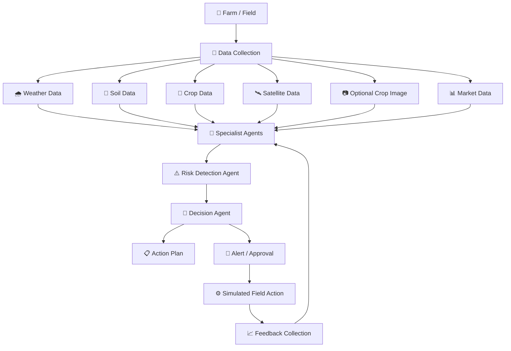

# 🌾 AgroMind AI
## Autonomous Farm-to-Field Advisory & Action Orchestration Platform

> **Hackathon**: **Bit N Build'26 Gujarat**  
> **Problem Statement**: **PS-6 (Autonomous Farm-to-Field Advisory & Action Orchestration Agents)**
>
> Build a simple, intelligent, location-aware farmer dashboard that combines weather, soil information, crop recommendations, crop-health camera analysis, farming cost estimation, and market-price insights in one easy-to-use platform.

---

## 1. Project Overview

AgroMind AI is a farmer-focused digital assistant designed for small and mid-scale farmers.

The platform provides localized and easy-to-understand recommendations based on:

- Farmer location
- Soil characteristics
- Current weather
- Forecasted weather
- Crop type and crop growth stage
- Crop health images
- Estimated cultivation cost
- Expected selling price
- Farming risks such as water stress, pests, and disease

The goal is to convert complex agricultural data into simple actions that a farmer can understand and follow.

The application should not present itself as a replacement for an agricultural expert. It should provide decision support, explain uncertainty, and recommend expert verification for serious crop diseases, pesticide use, and high-risk decisions.

---

## 2. Problem Statement Alignment

The official PS-6 problem focuses on fragmented farming decisions involving:

- Irrigation
- Nutrient management
- Pest and disease control
- Crop-stage-specific advice
- Weather conditions
- Market timing
- Action planning
- Task tracking
- Alerts and expert escalation

AgroMind AI addresses these requirements through a unified dashboard and an AI-assisted action workflow.

### 2.1 Autonomous Agent Architecture Workflow



### Our simplified approach

Instead of building a complex real-world IoT deployment, the hackathon MVP will use:

1. Location-based weather APIs
2. Simulated or manually entered soil sensor values
3. Crop and soil knowledge datasets
4. AI-generated explanations and action plans
5. A smart camera module for crop-image analysis
6. Location-based cost and price datasets
7. A task and notification system

This makes the project practical, demonstrable, and achievable within a hackathon.

---

## 3. Main Objective

Create a simple farmer dashboard where a farmer can:

1. Select or share their location.
2. View local weather and forecast information.
3. Enter or view soil quality information.
4. Get crop recommendations for their location and season.
5. See when to sow, irrigate, fertilize, and harvest.
6. Upload or capture a crop image using a smart camera.
7. Identify possible crop diseases, pests, or nutrient-related problems.
8. Receive recommended actions in simple language.
9. Estimate cultivation cost and expected selling value.
10. Track farming activities and receive reminders.
11. Escalate serious issues to an agricultural expert.

---

## 4. Target Users

### Primary users

- Small-scale farmers
- Mid-scale farmers
- Farmers with limited technical knowledge
- Farmers who need localized weather and crop guidance
- Farmers who want simple cost and selling-price estimates

### Secondary users

- Agricultural experts
- Farmer support organizations
- Agricultural officers
- Hackathon evaluators
- Demonstration administrators

---

## 5. Core Features

## 5.1 Farmer Profile and Location

The farmer can:

- Enter their name
- Select their state, district, and village/city
- Allow browser location access
- Select farm size
- Select soil type
- Select available irrigation method
- Select the crop currently being grown
- Select the crop growth stage

### Example profile

```text
Farmer: Mahesh Patel
Location: Surat, Gujarat
Farm Size: 2 acres
Soil Type: Loamy
Irrigation: Drip irrigation
Current Crop: Cotton
Crop Stage: Vegetative
```

The location is used to personalize weather, crop suitability, cost estimates, and market information.

---

## 5.2 Farmer Dashboard

The dashboard should be mobile-first because many farmers will use smartphones.

### Dashboard cards

- Current temperature
- Weather condition
- Rain probability
- Humidity
- Wind speed
- Soil moisture
- Soil pH
- Current crop
- Crop health status
- Estimated cultivation cost
- Expected revenue
- Today's recommended actions
- Alerts and warnings

### Example dashboard

```text
Good morning, Mahesh 👋

Location: Surat, Gujarat
Crop: Cotton
Farm Size: 2 acres

Weather
32°C | Partly cloudy
Rain probability: 40%
Humidity: 68%

Soil
Moisture: 22%      Status: Low
pH: 6.8            Status: Suitable
Nitrogen: Medium   Status: Monitor

Crop Health
Status: Attention required
Possible issue: Water stress

Today's Actions
1. Check irrigation lines
2. Inspect leaves for pest symptoms
3. Recheck soil moisture in the evening
```

---

## 5.3 Weather Data

Use a weather API to display current and forecast information.

### Weather information

- Current temperature
- Maximum and minimum temperature
- Rain probability
- Precipitation
- Relative humidity
- Wind speed
- Weather condition
- Forecast for the next 7–16 days when available

### Weather-based decisions

Examples:

- Avoid irrigation immediately before heavy rain.
- Alert the farmer about heat stress.
- Recommend checking drainage during heavy rainfall.
- Warn about conditions that may increase fungal disease risk.
- Suggest suitable weather windows for spraying only as a general advisory.

The system must not provide unsafe pesticide instructions without appropriate verification.

---

## 5.4 Soil Quality Module

The MVP should support two input methods.

### Method A: Manual input

The farmer enters:

- Soil moisture percentage
- Soil pH
- Nitrogen level
- Phosphorus level
- Potassium level
- Soil type
- Soil test date

### Method B: Simulated sensor data

For the hackathon, sensor values can be generated or updated through a demo control panel.

Example:

```json
{
  "soilMoisture": 22,
  "soilPH": 6.8,
  "nitrogen": "medium",
  "phosphorus": "high",
  "potassium": "medium",
  "temperature": 31,
  "timestamp": "2026-09-19T09:00:00+05:30"
}
```

### Soil status rules

Example rules:

- Low moisture → irrigation inspection recommendation
- Excessive moisture → drainage and root-rot risk warning
- pH outside crop suitability range → soil-test and expert consultation recommendation
- Low nutrient level → recommend soil testing and suitable nutrient planning
- Sudden sensor change → check sensor accuracy and field conditions

These rules are advisory and should not be treated as laboratory-grade soil diagnosis.

---

## 5.5 Crop Recommendation Engine

The platform recommends crops based on:

- Location
- Season
- Soil type
- Soil pH
- Water availability
- Temperature
- Rainfall forecast
- Farm size
- Farmer's budget
- Expected cultivation duration
- Market-price information when available

### Example recommendation output

```text
Recommended Crop: Groundnut

Why?
- Suitable for the selected soil profile
- Fits the selected season
- Water requirement is within the selected irrigation capacity
- Estimated cultivation period matches the farmer's available time

Before planting:
1. Perform a soil test
2. Confirm seed availability
3. Check local agricultural guidance
4. Compare current market prices
```

### Crop recommendation score

The application may calculate a transparent suitability score:

```text
Crop Suitability Score =
  Soil Compatibility       × 30%
  Weather Compatibility    × 25%
  Water Availability       × 20%
  Season Compatibility     × 15%
  Budget Compatibility     × 10%
```

The score is an internal prototype indicator, not an official agricultural certification.

The UI should show the reasons behind the score instead of showing an unexplained number.

---

## 5.6 Crop Calendar and Harvest Estimation

For each supported crop, store:

- Sowing period
- Germination period
- Vegetative stage
- Flowering stage
- Fruiting or grain-filling stage
- Expected crop duration
- Irrigation guidance
- Nutrient monitoring checkpoints
- Common pest and disease risks
- Approximate harvesting window

### Example

```text
Crop: Cotton

Current Stage: Vegetative

Next Activities:
- Inspect plant growth
- Monitor soil moisture
- Check leaves for pest symptoms
- Review the next 7-day weather forecast

Estimated Harvest Window:
Based on crop variety, sowing date, and crop duration.
```

Harvest dates must be shown as estimates. The actual harvest time depends on variety, weather, crop health, and local agricultural conditions.

---

## 5.7 Smart Camera / Crop Health Scanner

The farmer can:

- Open the camera on a mobile device
- Capture a crop or leaf image
- Upload an existing image
- Select crop type
- Submit the image for analysis

### Camera analysis output

The system should attempt to identify:

- Possible pest damage
- Possible fungal symptoms
- Possible bacterial symptoms
- Nutrient-deficiency-like symptoms
- Water stress symptoms
- Healthy-looking crop
- Poor image quality or uncertain result

### Example output

```text
Crop: Tomato
Image Result: Possible leaf disease symptoms
Confidence: Medium

Visible signs:
- Yellowing around leaf areas
- Small dark spots

Suggested next steps:
1. Capture a closer image of the affected leaf
2. Check whether the issue appears on multiple plants
3. Inspect the underside of leaves
4. Avoid applying chemicals without expert confirmation
5. Contact an agricultural expert if the problem spreads
```

### Important camera limitations

The image model may produce incorrect results because of:

- Poor lighting
- Blurry images
- Multiple diseases with similar symptoms
- Incorrect crop selection
- Hidden root or soil problems
- Camera angle
- Unseen environmental conditions

The application must display uncertainty and should recommend expert confirmation for severe or unclear cases.

---

## 5.8 AI Advisory and Action Plan

The AI module converts data into simple, prioritized actions.

### Input data

- Farmer location
- Weather data
- Soil values
- Crop type
- Crop stage
- Camera analysis
- Farm size
- Budget
- Crop calendar
- Market-price information

### Output

- Problem summary
- Risk level
- Reason for the recommendation
- Recommended action
- Estimated cost
- Best time to act
- Expected follow-up check
- Expert escalation recommendation

### Example

```text
Risk: Water stress
Priority: High

Why this was detected:
- Soil moisture is below the configured threshold
- Temperature is high
- No significant rainfall is forecast soon

Recommended actions:
1. Inspect the irrigation system
2. Check soil moisture at multiple points
3. Irrigate according to local crop and soil guidance
4. Recheck moisture after irrigation

Estimated cost:
₹300–₹600 for inspection or minor irrigation maintenance

Follow-up:
Check soil moisture again after 6–12 hours.
```

The AI must not invent sensor readings, market prices, weather information, or confirmed disease diagnoses.

---

## 5.9 Farming Cost Calculator

The farmer can estimate the cost of growing a crop.

### Cost categories

- Seeds
- Land preparation
- Labor
- Fertilizers
- Organic manure
- Irrigation
- Pesticide or crop-protection inputs
- Machinery rental
- Transportation
- Harvesting
- Packaging
- Miscellaneous expenses

### Formula

```text
Total Cost =
  Seed Cost
  + Land Preparation
  + Labor Cost
  + Fertilizer Cost
  + Irrigation Cost
  + Crop Protection Cost
  + Machinery Cost
  + Harvesting Cost
  + Transportation Cost
  + Other Costs
```

### Example

```text
Farm Size: 2 acres

Seeds:              ₹4,000
Land preparation:   ₹5,000
Labor:              ₹8,000
Fertilizer:         ₹6,000
Irrigation:         ₹3,000
Crop protection:    ₹4,000
Harvesting:         ₹7,000
Transportation:     ₹2,000

Estimated Total:    ₹39,000
```

All values in the demo should be clearly marked as estimated values and should be editable by the farmer.

---

## 5.10 Selling Price and Expected Revenue

The platform may display:

- Estimated local selling price
- Unit of measurement
- Price date
- Source of the price
- Minimum and maximum observed price when available
- Expected yield
- Estimated revenue
- Estimated profit or loss

### Formula

```text
Expected Revenue =
  Estimated Yield × Expected Selling Price
```

```text
Estimated Profit =
  Expected Revenue − Total Cultivation Cost
```

### Example

```text
Estimated Yield: 20 quintals
Expected Price: ₹6,000/quintal

Expected Revenue:
20 × ₹6,000 = ₹1,20,000

Estimated Cultivation Cost:
₹39,000

Estimated Profit:
₹1,20,000 − ₹39,000 = ₹81,000
```

The platform must clearly show that yield and prices can change due to weather, quality, demand, market location, transportation, and timing. The application must not promise a guaranteed profit.

---

## 5.11 Location-Based Market Module

Market information can be linked to:

- Selected district
- Nearby market or mandi
- Crop type
- Variety or quality
- Date of price observation
- Price unit
- Source URL or source label

### MVP fallback

If a reliable live market-price API is not available, use:

- A manually maintained JSON dataset
- A CSV uploaded by the administrator
- Simulated price records
- Clearly labeled demonstration data

Never present simulated prices as live official market prices.

---

## 5.12 Task Management and Action Orchestration

Each recommendation should become a trackable task.

### Task fields

- Task title
- Description
- Priority
- Due date
- Related crop
- Related risk
- Estimated cost
- Status
- Assigned person
- Completion note

### Task statuses

```text
Pending → In Progress → Completed
                  ↘
                Escalated
```

### Example tasks

```text
[High] Check irrigation system
[Medium] Capture a clearer leaf image
[Medium] Review weather forecast
[Low] Update cultivation expense
```

The farmer can mark tasks as completed. The system should keep a history of actions and results.

---

## 5.13 Alerts and Expert Escalation

The platform should generate alerts for:

- Very low soil moisture
- Excessive rainfall risk
- Strong heat conditions
- Possible disease spread
- Repeated failed actions
- Missing task completion
- Uncertain or high-risk camera analysis

### Escalation flow

```text
Risk Detected
     ↓
AI Generates Explanation
     ↓
Farmer Receives Recommended Action
     ↓
Farmer Completes or Rejects Action
     ↓
If Risk Continues:
Escalate to Expert / Show Contact Guidance
```

For the hackathon, expert escalation can be implemented as:

- A support request form
- A simulated expert dashboard
- A WhatsApp/phone contact placeholder
- An email notification
- A request status tracker

Do not claim that a real agricultural officer has been contacted unless an actual integration confirms it.

---

# 6. Proposed User Flow

```text
Open AgroMind AI
       ↓
Select Language
       ↓
Enter Location and Farm Details
       ↓
Fetch Weather Information
       ↓
Enter Soil Data / Load Simulated Sensor Data
       ↓
Select Current Crop or Ask for Crop Recommendation
       ↓
View Crop Suitability and Crop Calendar
       ↓
Capture Crop Image
       ↓
AI Crop Health Analysis
       ↓
Generate Risk-Based Action Plan
       ↓
Estimate Cost and Expected Selling Value
       ↓
Create Tasks and Alerts
       ↓
Track Completion and Escalate if Required
```

---

# 7. Technology Stack

## Frontend

- Next.js
- React
- TypeScript
- Tailwind CSS
- Responsive mobile-first UI
- Recharts for graphs
- Leaflet or MapLibre for map visualization, if needed

## Backend

- Next.js Route Handlers or Node.js
- REST API endpoints
- Server-side API key protection
- Validation using Zod

## Database

- Supabase PostgreSQL
- Supabase Storage for crop images, if required
- Row Level Security for user-specific data

## AI

- Gemini API for:
  - Explanations
  - Crop advisory
  - Action-plan generation
  - Structured summaries
- Vision-capable model for crop-image analysis, subject to model availability
- Rule-based risk engine for predictable alerts

## External Data

- Open-Meteo for weather and forecast data
- Location/geocoding provider, if needed
- Public agricultural datasets
- Admin-maintained crop knowledge dataset
- Simulated sensor dataset
- Simulated or sourced market-price dataset

## Development

- GitHub
- Environment variables
- ESLint
- TypeScript strict mode
- Automated validation
- Seed scripts for demo data

---

# 8. API Plan

## 8.1 Weather API

### Recommended option

Open-Meteo can be used for prototyping weather data.

Possible data:

- Temperature
- Rainfall
- Weather code
- Humidity
- Wind speed
- Forecast

The application should cache weather responses and avoid unnecessary API requests.

Example internal endpoint:

```http
GET /api/weather?latitude=21.17&longitude=72.83
```

---

## 8.2 AI API

Use a server-side API route so the API key is not exposed in the browser.

```http
POST /api/ai/advisory
POST /api/ai/crop-analysis
POST /api/ai/crop-recommendation
```

The backend should request structured JSON from the model.

Example response structure:

```json
{
  "riskLevel": "medium",
  "title": "Possible water stress",
  "explanation": "Soil moisture is below the configured threshold.",
  "actions": [
    {
      "title": "Inspect irrigation",
      "priority": "high",
      "estimatedCost": 300,
      "dueInHours": 6
    }
  ],
  "requiresExpert": false,
  "disclaimer": "This is an advisory result and should be verified locally."
}
```

---

## 8.3 Crop Data API

For the MVP, crop information can be stored in PostgreSQL or JSON.

```http
GET /api/crops
GET /api/crops/:cropId
POST /api/crop-recommendations
```

Data fields:

```json
{
  "name": "Cotton",
  "season": ["kharif"],
  "soilTypes": ["loamy", "black"],
  "phRange": {
    "min": 5.5,
    "max": 8.0
  },
  "durationDays": 160,
  "waterRequirement": "medium",
  "commonRisks": ["pest", "water stress"]
}
```

The crop data should be reviewed and labeled as reference information.

---

## 8.4 Soil API

```http
GET /api/farms/:farmId/soil
POST /api/farms/:farmId/soil
GET /api/farms/:farmId/soil/history
```

The API should store:

- Soil moisture
- pH
- Nitrogen
- Phosphorus
- Potassium
- Data source
- Timestamp
- Unit
- Optional sensor ID

---

## 8.5 Crop Image API

```http
POST /api/crop-images
POST /api/ai/crop-analysis
GET /api/crop-images/:imageId
```

Security requirements:

- Validate file type
- Limit file size
- Remove unnecessary metadata where possible
- Restrict access to the farmer's own images
- Avoid storing images permanently unless the user agrees
- Provide a delete option

---

## 8.6 Cost and Market API

```http
POST /api/cost-estimates
GET /api/market-prices?crop=cotton&location=surat
```

Market records should include:

```json
{
  "crop": "Cotton",
  "location": "Surat",
  "price": 6500,
  "unit": "quintal",
  "observedAt": "2026-09-19",
  "sourceType": "demo",
  "isLive": false
}
```

---

# 9. Database Design

## users

```text
id
name
phone_or_email
preferred_language
created_at
```

## farms

```text
id
user_id
name
latitude
longitude
state
district
village
area
area_unit
soil_type
irrigation_type
created_at
```

## crops

```text
id
name
season
duration_days
soil_requirements
water_requirement
crop_calendar
common_risks
```

## farm_crops

```text
id
farm_id
crop_id
sowing_date
growth_stage
estimated_harvest_date
status
```

## soil_readings

```text
id
farm_id
soil_moisture
soil_ph
nitrogen
phosphorus
potassium
source_type
recorded_at
```

## weather_snapshots

```text
id
farm_id
temperature
humidity
rain_probability
precipitation
wind_speed
recorded_at
```

## crop_images

```text
id
farm_id
storage_path
crop_name
analysis_status
created_at
```

## crop_analyses

```text
id
image_id
possible_issue
confidence
symptoms
recommendations
requires_expert
created_at
```

## tasks

```text
id
farm_id
title
description
priority
status
due_at
estimated_cost
created_at
completed_at
```

## market_prices

```text
id
crop_id
location
price
unit
source_type
observed_at
```

## cost_estimates

```text
id
farm_id
crop_id
seed_cost
labor_cost
fertilizer_cost
irrigation_cost
crop_protection_cost
machinery_cost
harvesting_cost
transportation_cost
other_cost
total_cost
created_at
```

---

# 10. Recommended Pages

## 10.1 Onboarding

- Welcome screen
- Language selection
- Location selection
- Farm information
- Soil and irrigation information

## 10.2 Dashboard

- Weather summary
- Soil health
- Crop status
- Risk alerts
- Today's tasks
- Cost and revenue summary

## 10.3 Weather

- Current weather
- Forecast
- Rain probability
- Weather-related advisory
- Weather history

## 10.4 Soil Health

- Soil readings
- Manual entry form
- Simulated sensor controls
- Soil history graph
- Soil warnings

## 10.5 Crop Recommendation

- Crop selection
- Recommended crops
- Suitability reasons
- Water requirement
- Expected duration
- Estimated cost
- Crop calendar

## 10.6 Smart Camera

- Camera/upload interface
- Crop selection
- Image preview
- Analysis result
- Confidence and limitations
- Recommended actions
- Expert escalation

## 10.7 Cost and Market

- Expense form
- Total cost
- Expected yield
- Selling-price input
- Revenue estimate
- Profit/loss estimate
- Price source and date

## 10.8 Tasks

- Pending tasks
- Completed tasks
- Priority filters
- Due dates
- Action history

## 10.9 Expert Support

- Create support request
- Upload supporting image
- Describe the problem
- Request status
- Contact information placeholder

## 10.10 Admin/Demo Panel

- Change simulated sensor values
- Trigger drought/water-stress event
- Trigger disease event
- Trigger heavy-rain event
- Add market-price records
- View demo farmers
- View task status

---

# 11. MVP Scope for the Hackathon

The first version should focus on one complete, reliable demonstration.

## Must-have features

- [ ] Farmer location and profile
- [ ] Weather API integration
- [ ] Simulated soil readings
- [ ] One or two supported crops
- [ ] Rule-based water-stress detection
- [ ] Gemini-generated advisory
- [ ] Crop image upload
- [ ] Basic crop-image analysis
- [ ] Cost calculator
- [ ] Simulated local selling price
- [ ] Task creation and completion
- [ ] Mobile-responsive dashboard
- [ ] Clear disclaimers and uncertainty display

## Nice-to-have features

- [ ] Multi-language support
- [ ] Voice input
- [ ] Offline caching
- [ ] Interactive farm map
- [ ] Expert dashboard
- [ ] Notifications
- [ ] More crop varieties
- [ ] Historical charts
- [ ] Real sensor integration
- [ ] Real market-price provider

## Avoid in the first version

- Complex hardware deployment
- Guaranteed disease diagnosis
- Automatic pesticide purchasing
- Unverified live mandi prices
- Automatic irrigation control
- Real financial transactions
- Unapproved expert or government integrations
- Large-scale multi-region crop coverage

---

# 12. Demonstration Scenario

## Scenario: Cotton farm in Surat

### Initial data

```text
Location: Surat, Gujarat
Farm Size: 2 acres
Crop: Cotton
Crop Stage: Vegetative
Soil Moisture: 22%
Temperature: 35°C
Rain Probability: 10%
Soil pH: 6.8
```

### System behavior

1. Weather API returns hot conditions and low rain probability.
2. Soil rules identify low moisture.
3. Dashboard displays a high-priority water-stress alert.
4. AI generates an easy-to-understand explanation.
5. The system creates an irrigation inspection task.
6. Farmer uploads a leaf image.
7. Camera module returns a possible symptom with medium confidence.
8. System asks the farmer to inspect more plants and consult an expert if the issue spreads.
9. Cost calculator estimates irrigation or inspection expenses.
10. Farmer marks the task as completed.
11. Dashboard updates the farm's action history.

---

# 13. AI Safety and Reliability Rules

The AI must follow these rules:

1. Never invent weather, soil, crop, market, or sensor data.
2. Clearly distinguish live, simulated, manually entered, and estimated data.
3. Use structured JSON responses for backend processing.
4. Include confidence or uncertainty where appropriate.
5. Avoid definitive disease diagnosis from a single image.
6. Avoid unsafe pesticide dosage recommendations.
7. Recommend expert confirmation for severe or uncertain issues.
8. Explain why a recommendation was generated.
9. Show the date and source of market-price data.
10. Never promise guaranteed crop yield or profit.
11. Use simple language and support regional-language translation where possible.
12. Allow the farmer to reject or edit a recommendation.
13. Store user data securely.
14. Provide deletion controls for uploaded crop images.
15. Keep automated actions limited to safe demo tasks unless real authorization is available.

---

# 14. Environment Variables

Create a `.env.local` file:

```env
NEXT_PUBLIC_SUPABASE_URL=
NEXT_PUBLIC_SUPABASE_ANON_KEY=
SUPABASE_SERVICE_ROLE_KEY=
GEMINI_API_KEY=
OPEN_METEO_BASE_URL=https://api.open-meteo.com
NEXT_PUBLIC_APP_URL=http://localhost:3000
```

Never expose private server keys in frontend code.

---

# 15. Suggested Folder Structure

```text
agromind-ai/
├── app/
│   ├── dashboard/
│   ├── weather/
│   ├── soil/
│   ├── crops/
│   ├── camera/
│   ├── costs/
│   ├── tasks/
│   ├── expert-support/
│   └── api/
│       ├── weather/
│       ├── soil/
│       ├── advisory/
│       ├── crop-analysis/
│       ├── recommendations/
│       └── market-prices/
├── components/
│   ├── dashboard/
│   ├── weather/
│   ├── soil/
│   ├── crops/
│   ├── camera/
│   ├── charts/
│   └── ui/
├── lib/
│   ├── supabase/
│   ├── weather/
│   ├── ai/
│   ├── rules/
│   ├── calculations/
│   └── validation/
├── data/
│   ├── crops.json
│   ├── demo-farms.json
│   ├── demo-market-prices.json
│   └── crop-diseases.json
├── types/
├── public/
└── README.md
```

---

# 16. Development Plan

## Phase 1: Project Setup

- Create Next.js project
- Configure TypeScript and Tailwind
- Set up Supabase
- Configure environment variables
- Create base layout and navigation

## Phase 2: Farmer Profile

- Create onboarding form
- Store location and farm information
- Add language preference
- Create demo farmer profile

## Phase 3: Weather and Soil

- Integrate weather API
- Add weather cards
- Add soil input form
- Add simulated sensor controls
- Add soil history chart

## Phase 4: Crop Recommendation

- Add crop dataset
- Create crop suitability rules
- Add crop calendar
- Show reasons behind recommendations

## Phase 5: AI Advisory

- Create backend AI route
- Add structured prompts
- Combine weather, soil, and crop data
- Generate action plans
- Add risk levels and disclaimers

## Phase 6: Smart Camera

- Add image upload and camera capture
- Validate images
- Send image to vision model
- Show possible symptoms and next actions
- Add confidence and expert escalation

## Phase 7: Cost and Market

- Add cost calculator
- Add estimated yield input
- Add selling price input
- Calculate revenue and estimated profit
- Label demo prices clearly

## Phase 8: Tasks and Final Demo

- Convert recommendations into tasks
- Add completion tracking
- Add alerts
- Improve mobile responsiveness
- Add demo mode
- Test the complete farmer journey

---

# 17. Definition of Done

The MVP is complete when a user can:

1. Open the application on a mobile or desktop browser.
2. Enter a farm location and crop.
3. View weather information.
4. View soil data or simulated readings.
5. Receive a crop suitability recommendation.
6. See a crop calendar and estimated harvest window.
7. Upload a crop image.
8. Receive a possible issue and recommended next steps.
9. Calculate cultivation cost and estimated revenue.
10. View a clearly labeled market-price estimate.
11. Create and complete an action task.
12. Understand which data is live, simulated, estimated, or AI-generated.

---

# 18. Evaluation and Demo Points

During the presentation, demonstrate:

- A clean farmer-friendly interface
- Location-aware weather information
- Soil risk detection
- Crop recommendation with explanations
- Smart camera analysis
- AI action-plan generation
- Cost and revenue estimation
- Task tracking
- Expert escalation concept
- Responsible AI limitations
- A complete end-to-end workflow

### Key presentation statement

> AgroMind AI does not only show agricultural information. It converts farm data into understandable, prioritized, and trackable actions for farmers.

---

# 19. Future Scope

- Real IoT soil sensors using MQTT
- Automatic sensor ingestion
- Satellite and drone imagery
- Regional-language voice assistant
- Offline-first mobile application
- Expert video consultation
- Government agricultural scheme information
- Verified mandi and commodity-price integrations
- Crop yield prediction
- Farm-level digital records
- Community-based pest alerts
- Integration with authorized agricultural institutions

---

# 20. Final Project Summary

AgroMind AI is a location-aware, AI-assisted farm management and advisory dashboard.

It combines:

```text
Location
   + Weather
   + Soil Data
   + Crop Information
   + Camera Analysis
   + Crop Calendar
   + Cost Estimation
   + Market Information
   + AI Advisory
   + Task Tracking
   = Farmer Decision Support Platform
```

The project is designed as a practical hackathon prototype. It uses simulated sensor and market data where live integrations are unavailable, clearly labels estimates, and keeps the farmer in control of important decisions.

---

# 21. Instructions for Antigravity AI Coding Agent

You are an expert full-stack engineer building a hackathon-ready application named **AgroMind AI**.

Build a complete, working, responsive web application using:

- Next.js with App Router
- TypeScript
- Tailwind CSS
- Supabase PostgreSQL
- Gemini API through secure server-side routes
- Open-Meteo for weather data
- Recharts for graphs
- Browser camera/file upload for crop images

## Product requirements

Create a mobile-first farmer dashboard with these modules:

1. Onboarding and farmer profile
2. Location and weather dashboard
3. Soil quality dashboard
4. Crop recommendation
5. Crop calendar and harvest estimate
6. Smart crop camera
7. AI crop advisory
8. Cultivation cost calculator
9. Selling-price and revenue estimate
10. Tasks and action tracking
11. Alerts and expert escalation
12. Demo/admin controls for simulated data

## Implementation requirements

- Use reusable React components.
- Use strict TypeScript.
- Use Zod for request validation.
- Keep API keys on the server.
- Use Supabase Row Level Security where applicable.
- Use loading, empty, error, and success states.
- Use accessible labels and keyboard navigation.
- Make the UI responsive on mobile, tablet, and desktop.
- Use realistic demo data for the first launch.
- Include a demo mode that works even without external API keys.
- Clearly label simulated, estimated, and live data.
- Never expose fake data as real live market data.
- Never claim guaranteed crop yield, profit, or disease diagnosis.
- Show uncertainty in camera results.
- Use rule-based logic for basic risk detection and Gemini for explanation and action-plan generation.
- Do not automatically control irrigation or apply chemicals.
- Add an expert-support form for uncertain or severe cases.

## UI design direction

Use a clean, modern, trustworthy agricultural dashboard:

- Soft green and earth-tone visual language
- High contrast and readable typography
- Large touch-friendly controls
- Simple cards with clear labels
- Icons for weather, soil, crops, camera, cost, and tasks
- Charts that are understandable to nontechnical users
- Avoid excessive gradients, clutter, and complicated terminology
- Support Gujarati, Hindi, and English-ready text structure
- Use clear warning colors only when needed
- Make the primary dashboard usable by a farmer with limited technical knowledge

## Demo data

Include a demo farm:

```text
Location: Surat, Gujarat
Farm Size: 2 acres
Crop: Cotton
Crop Stage: Vegetative
Soil Moisture: 22%
Soil pH: 6.8
Temperature: 35°C
Rain Probability: 10%
```

Create demo events for:

- Low soil moisture
- Heavy rain warning
- Possible crop disease
- Completed irrigation task
- Estimated cultivation cost
- Simulated local selling price

## Build order

1. Set up the project and layout.
2. Create the dashboard shell.
3. Add farmer profile and location.
4. Add weather integration with fallback demo data.
5. Add soil module and rule engine.
6. Add crop dataset and recommendation logic.
7. Add Gemini advisory route.
8. Add crop image upload and analysis.
9. Add cost and revenue calculator.
10. Add tasks and alerts.
11. Add demo mode.
12. Test all main user flows.
13. Fix TypeScript, lint, and runtime errors.
14. Provide setup instructions and environment-variable documentation.

## Important behavior

If an external API is unavailable:

- Do not break the application.
- Show demo data with a visible "Demo Data" label.
- Show a friendly error state.
- Keep the main dashboard functional.

Do not implement placeholder buttons that appear functional but do nothing. Every visible action must either work, show a meaningful state, or be clearly marked as unavailable in demo mode.

Deliver a polished, working prototype suitable for a hackathon presentation.
