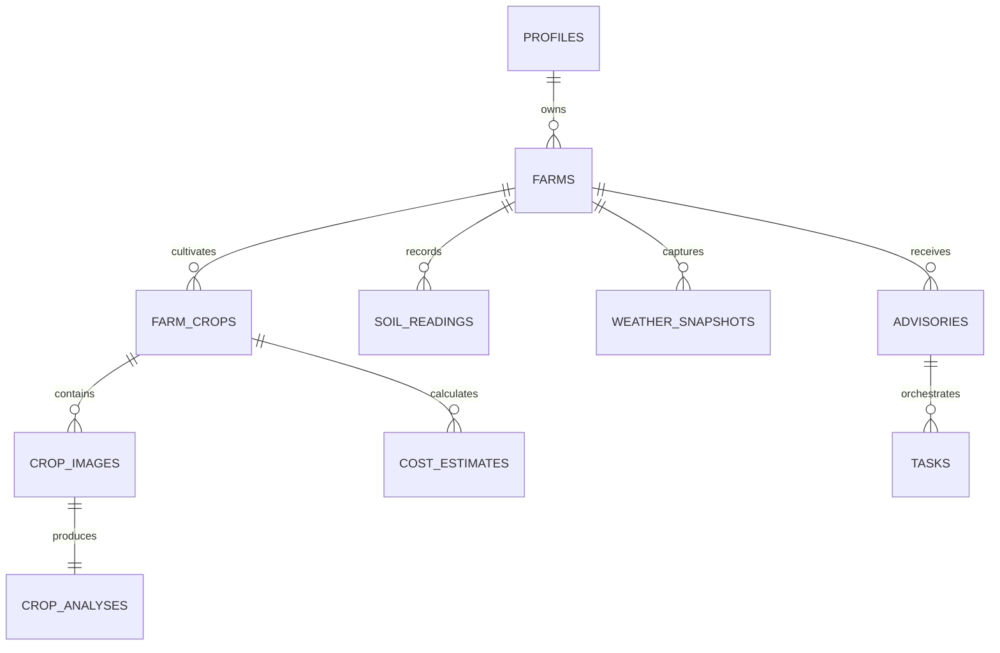

# 🌾 AgroMind AI

> **"From Soil Insights to Smarter Harvests."**  
> An autonomous, location-aware farm-to-field advisory and action orchestration platform empowering farmers with hyper-local intelligence, real-time risk detection, and transparent decision support.

[](https://nextjs.org/)
[](https://www.typescriptlang.org/)
[](https://tailwindcss.com/)
[](https://supabase.com/)
[](https://ai.google.dev/)
[](https://open-meteo.com/)
[](#26-license)
[](#-project-status-notice)

---

| **Metric / Detail** | **Specification** |
|---|---|
| **Problem Statement** | **Problem Statement 6: Autonomous Farm-to-Field Advisory & Action Orchestration Agents** |
| **Hackathon Event** | `[Insert Hackathon Name / Event Here]` |
| **Repository** | [https://github.com/Xcoder-69/HACKFORGE](https://github.com/Xcoder-69/HACKFORGE) |
| **Live Demo URL** | `[https://agromind-ai.vercel.app - Placeholder / In Progress]` |
| **Target Audience** | Small & mid-scale farmers, Farmer Producer Organizations (FPOs), agronomists |
| **Core Paradigm** | Hybrid AI (Rule-Based Agronomy Engine + Google Gemini Generative Advisory) |

---

> ### ⚠️ Project Status Notice
> This repository represents the **Hackathon Architecture & MVP Scaffolding**. Features below are categorized by their implementation status:
> - **[Implemented / In Progress]**: Core repository scaffolding, branch collaboration structure, architecture specifications, API contracts, and schema designs.
> - **[Hackathon MVP / Demo]**: Open-Meteo integration, rule-based crop recommendation logic, Gemini advisory prompts, simulated sensor control panel, and demo market datasets.
> - **[Planned / Future Enhancement]**: Hardware IoT telemetry, verified live APMC mandi webhooks, SMS/WhatsApp gateways, and automated satellite imagery integration.

---

## 📑 Table of Contents

- [1. Project Header](#-agromind-ai)
- [2. Table of Contents](#-table-of-contents)
- [3. Problem Statement](#3-problem-statement)
- [4. Our Solution](#4-our-solution)
- [5. Key Features](#5-key-features)
  - [5.1 Farmer Onboarding](#51-farmer-onboarding)
  - [5.2 Smart Dashboard](#52-smart-dashboard)
  - [5.3 Weather Intelligence](#53-weather-intelligence)
  - [5.4 Soil Insights](#54-soil-insights)
  - [5.5 Crop Recommendation Engine](#55-crop-recommendation-engine)
  - [5.6 Smart Crop Camera](#56-smart-crop-camera)
  - [5.7 Cultivation Cost Calculator](#57-cultivation-cost-calculator)
  - [5.8 Market Prices & Revenue Estimator](#58-market-prices--revenue-estimator)
  - [5.9 Action Center & Task Orchestration](#59-action-center--task-orchestration)
- [6. Unique Selling Proposition (USP)](#6-unique-selling-proposition-usp)
- [7. Technology Stack](#7-technology-stack)
- [8. System Architecture](#8-system-architecture)
  - [8.1 MVP Architecture](#81-mvp-architecture)
  - [8.2 Target Production Architecture](#82-target-production-architecture)
- [9. AI Architecture & Verification](#9-ai-architecture--verification)
- [10. Data Sources & API Integrations](#10-data-sources--api-integrations)
- [11. Project Structure](#11-project-structure)
- [12. Installation & Local Setup](#12-installation--local-setup)
- [13. Environment Variables](#13-environment-variables)
- [14. Database Design & Schemas](#14-database-design--schemas)
- [15. User Workflow](#15-user-workflow)
- [16. Safety & Responsible AI Disclaimer](#16-safety--responsible-ai-disclaimer)
- [17. Security, Privacy & Data Governance](#17-security-privacy--data-governance)
- [18. Testing Strategy](#18-testing-strategy)
- [19. MVP vs. Future Roadmap](#19-mvp-vs-future-roadmap)
- [20. Deployment & Production Readiness](#20-deployment--production-readiness)
- [21. Cost Planning & Resource Estimation](#21-cost-planning--resource-estimation)
- [22. Business & Scaling Opportunities](#22-business--scaling-opportunities)
- [23. Hackathon Demonstration Script](#23-hackathon-demonstration-script)
- [24. Screenshots](#24-screenshots)
- [25. Team & Contributors](#25-team--contributors)
- [26. License](#26-license)

---

## 3. Problem Statement

Agriculture forms the backbone of global economies, yet small- and mid-scale farmers navigate an intensely volatile operational environment. Today, farmers face several critical bottlenecks:

1. **Information Fragmentation**: Weather forecasts, soil analysis reports, market prices, and pest diagnoses exist across disconnected portals, paper lab reports, or word-of-mouth advice.
2. **Data Indigestibility**: Raw meteorological charts (e.g., barometric pressure, dew point) and soil chemistry values (e.g., micro-Siemens conductivity, available nitrogen in kg/ha) fail to translate into clear, timely field instructions.
3. **Delayed Diagnostic Cycles**: When symptoms of leaf blights, fungal spots, or aphid infestations manifest, seeking agronomist consultation can take days, allowing irreversible crop damage.
4. **Opaque Cultivation Economics**: Farmers frequently incur seasonal debt without a structured breakdown of operational expenditures (seeds, machinery rent, fertilizer, hired labor) versus expected harvest revenues.
5. **Market Price Asymmetry**: Local middlemen frequently capitalize on farmers' lack of visibility into regional Mandi (APMC) market trends.
6. **Absence of Action Orchestration**: Knowing that rain is imminent is insufficient; farmers require orchestrated tasks (e.g., *"Delay foliar spray by 48 hours; clear drainage trench #2 today"*).

AgroMind AI solves this disconnect by converting disparate agricultural signals into structured, prioritized, and safety-governed action workflows.

---

## 4. Our Solution

AgroMind AI bridges the gap between raw agronomic data and field-level execution through an **Autonomous Farm-to-Field Advisory & Action Orchestration pipeline**:

```text
┌─────────────────────────────────────────────────────────────┐
│                    1. FARMER PROFILE                        │
│   Location (GPS/District), Land Size, Soil Type, Crop Stage │
└──────────────────────────────┬──────────────────────────────┘
                               │
                               ▼
┌─────────────────────────────────────────────────────────────┐
│              2. TELEMETRY & CONTEXT INGESTION               │
│   Open-Meteo Weather Data  +  Soil Telemetry (Manual/Demo)  │
└──────────────────────────────┬──────────────────────────────┘
                               │
                               ▼
┌─────────────────────────────────────────────────────────────┐
│             3. HYBRID DECISION ENGINE                       │
│   Deterministic Agronomic Rules  +  Gemini Pro / Vision AI  │
│   (Nutrient Ranges, Rain Windows, Pest Symptom Parsing)     │
└──────────────────────────────┬──────────────────────────────┘
                               │
                               ▼
┌─────────────────────────────────────────────────────────────┐
│             4. SAFETY & CONFIDENCE FILTER                   │
│   Confidence Scoring, Zod Validation, Escalation Flagging   │
└──────────────────────────────┬──────────────────────────────┘
                               │
                               ▼
┌─────────────────────────────────────────────────────────────┐
│          5. ORCHESTRATED ACTION & ECONOMIC SUMMARY          │
│   Prioritized Daily Tasks, Safe Interventions, Cost/Revenue │
└──────────────────────────────┬──────────────────────────────┘
                               │
                               ▼
┌─────────────────────────────────────────────────────────────┐
│            6. TASK TRACKING & AUDIT HISTORY                 │
│   Farmer Status Checkoffs, Feedback Loop, Expert Escalation │
└─────────────────────────────────────────────────────────────┘
```

### Why This Solution Works
- **Context-Aware**: Advice is grounded in the farmer's specific microclimate, crop growth phase, and soil parameters.
- **Action-Oriented**: Replaces abstract analytics with prioritized, step-by-step chores.
- **Transparent & Realistic**: AI provides probabilistic observations and safe cultural practices; it **never replaces agricultural officers** or prescribes restricted chemical dosages autonomously.

---

## 5. Key Features

### 5.1 Farmer Onboarding `[Hackathon MVP]`
- **Geographic Location**: Manual district selection or one-click browser geolocation.
- **Field Configuration**: Landholding acreage, primary soil classification (Loamy, Clayey, Sandy, Black Cotton, Red Soil).
- **Irrigation Inventory**: Rain-fed, canal, borewell, drip, or micro-sprinkler.
- **Active Cultivation Context**: Crop variety, sowing timestamp, current physiological stage (Sowing, Vegetative, Flowering, Fruiting, Maturity).
- **Language Preference**: UI foundation designed for regional languages (English, Hindi, Gujarati).

### 5.2 Smart Dashboard `[Hackathon MVP]`
- **Glanceable Status Cards**: Real-time ambient temperature, humidity, rain probability, soil moisture index, and crop health status.
- **Top Priority Alert Banner**: Instant visual cues for urgent conditions (e.g., heat stress alerts, irrigation delays).
- **Today's Action Feed**: Dynamic, ordered checklist generated by the advisory engine.

### 5.3 Weather Intelligence `[Hackathon MVP]`
- **Live Meteorological Feed**: Hyper-local data fetched via Open-Meteo API without requiring proprietary hardware.
- **Key Parameters**: Ambient temperature, relative humidity, wind speed/direction, precipitation probability, and multi-day forecasts.
- **Agronomic Translation**: Automated heuristics that translate forecasts into farming advice (e.g., *"High rain probability (>70%) forecasted tomorrow — postpone urea top-dressing to prevent runoff leaching"*).

### 5.4 Soil Insights `[Hackathon MVP / Simulated]`
- **Dual Ingestion Mode**:
  - *Manual Entry*: Input data from physical Soil Health Cards (Moisture %, pH, N-P-K status).
  - *Simulated Control Panel*: Interactive mock sensor controls to demonstrate real-time alert triggers during presentations.
- **Advisory Thresholds**: Flags deviations (e.g., pH < 6.0 indicates acidity; soil moisture < 20% indicates deficit stress).

### 5.5 Crop Recommendation Engine `[Hackathon MVP]`
- **Multi-Factor Scoring Matrix**: Evaluates seasonal appropriateness (Kharif/Rabi/Zaid), soil compatibility, water availability, and cultivation budget.
- **Transparent Justification**: Shows clear rationale (e.g., *"Groundnut is recommended because your loamy soil promotes pod development and current water levels match its moderate requirement"*).
- **Pre-Planting Checkpoints**: Lists mandatory preliminary steps (certified seed acquisition, soil solarization, basal fertilization).

### 5.6 Smart Crop Camera `[Hackathon MVP / Demo]`
- **Image Input**: Direct device camera capture or file upload (JPEG/PNG).
- **AI-Assisted Observations**: Analyzes visual foliage symptoms (e.g., chlorosis, necrotic margins, powdery patches).
- **Safe Advisory Output**: Outputs non-definitive symptom analysis, confidence ratings, organic/cultural prevention techniques, and an explicit advisory note.
- **Expert Escalation Trigger**: Low confidence or severe blight symptoms automatically trigger an *"Escalate to Agronomist"* warning.

### 5.7 Cultivation Cost Calculator `[Hackathon MVP]`
- **Itemized Operational Expenditure (OpEx)**:
  - Land preparation & tillage
  - Certified seeds / nursery saplings
  - Organic compost & synthetic fertilizers
  - Irrigation power & canal tariffs
  - Labor costs (weeding, spraying, harvesting)
  - Machinery lease & post-harvest transportation
- **Economic Metrics**: Computes Total Cultivation Cost, Cost per Acre, and Break-Even Unit Price.

### 5.8 Market Prices & Revenue Estimator `[Demo / Estimated]`
- **Mandi Pricing Records**: Sourced from demo datasets reflecting regional APMC benchmark prices.
- **Price Range Transparency**: Minimum, Maximum, and Modal price per quintal with data source and date stamps clearly labeled.
- **Revenue Modeling**: Calculates Expected Revenue and Estimated Net Profit based on farmer's yield projections.

### 5.9 Action Center & Task Orchestration `[Hackathon MVP]`
- **Task Orchestration**: Automatically converts AI advisories into structured, actionable items.
- **Attributes**: Priority levels (Low, Medium, High, Critical), category tags, due dates, estimated cost of action, and status toggles (Pending, In-Progress, Completed, Escalated).
- **Audit History**: Maintains a log of completed tasks for seasonal performance review.

---

## 6. Unique Selling Proposition (USP)

1. **Hyper-Local Contextualization**: Integrates farmer geography, active crop stage, weather telemetry, and soil condition simultaneously.
2. **Action-First Paradigm**: Moves beyond passive statistical dashboards by generating structured, time-sensitive task checklists.
3. **Hybrid Intelligence**: Combines deterministic agricultural rules with Google Gemini’s contextual natural language generation to prevent hallucinations.
4. **Accessible, Mobile-First UX**: Clean typography, high-contrast indicators, and minimal jargon designed for low-literacy field conditions.
5. **End-to-End Economic Visibility**: Unifies agronomic field advice with cultivation cost tracking and projected market yield margins.
6. **Rigorous Human-in-the-Loop Safeguards**: Explicitly flags uncertainty, avoids unregulated chemical prescriptions, and offers agronomic escalation routes.
7. **Modular Monolithic Architecture**: Streamlined for fast hackathon deployment while maintaining clean domain boundaries for future microservices.
8. **Low-Bandwidth & Voice-Ready Foundation**: Architectural abstractions support offline caching, PWA manifests, and future speech-to-text models.

---

## 7. Technology Stack

| Category | Technology | Version / Spec | Purpose in AgroMind AI |
|---|---|---|---|
| **Frontend Framework** | **Next.js** | `v14+` (App Router) | Server-side rendering, client hydration, and optimized routing |
| **Language** | **TypeScript** | `v5.0+` | End-to-end type safety across API boundaries and schemas |
| **Styling & Design System** | **Tailwind CSS** | `v3.4+` | Rapid, responsive, mobile-first utility styling |
| **UI Components** | **shadcn/ui / Radix** | Accessible Primitives | Accessible modal dialogs, accordions, tabs, and form elements |
| **Backend & Routing** | **Next.js Route Handlers** | Edge / Node.js Runtime | Server-side API endpoints, auth verification, and key isolation |
| **Database** | **Supabase PostgreSQL** | `v15+` | Relational persistence, JSONB support, and Row Level Security |
| **Authentication** | **Supabase Auth** | JWT / Session | User signup, session persistence, and role-based access control |
| **Object Storage** | **Supabase Storage** | S3-Compatible Buckets | Secure storage for encrypted crop pathology foliage imagery |
| **Artificial Intelligence** | **Google Gemini API** | `gemini-1.5-flash` / `pro` | Generative crop advisory synthesis and multi-modal image evaluation |
| **Weather Telemetry** | **Open-Meteo API** | REST / Geo-Coordinates | Real-time weather, precipitation probability, and wind metrics |
| **Visualization** | **Recharts** | React SVG Components | Historical temperature, soil moisture trends, and OpEx breakdowns |
| **Schema Validation** | **Zod** | `v3.22+` | Strict runtime parsing of form inputs and AI JSON responses |
| **Hosting & CI/CD** | **Vercel** | Git Integration | Global edge deployment, automated PR preview environments |
| **Source Control** | **GitHub** | Git Branches & Actions | Multi-member team collaboration and repository governance |

> *Note: Actual dependency versions should be cross-verified against `package.json` upon code installation.*

---

## 8. System Architecture

### 8.1 MVP Architecture

```text
┌─────────────────────────────────────────────────────────────────────────────┐
│                          CLIENT (BROWSER / PWA)                             │
│       React Components (Dashboard, Camera Scanner, Cost Calculator, Tasks)  │
└──────────────────────────────────────┬──────────────────────────────────────┘
                                       │ HTTPS / JSON
                                       ▼
┌─────────────────────────────────────────────────────────────────────────────┐
│                      NEXT.JS APPLICATION LAYER (SERVER)                     │
│  ┌───────────────────────────────────────────────────────────────────────┐  │
│  │ API Routes & Middleware (/api/weather, /api/ai/advisory, /api/tasks)   │  │
│  │ - Zod Runtime Schema Validation                                       │  │
│  │ - Rate Limiting & Error Handling                                      │  │
│  │ - Service Key Security Sandbox                                        │  │
│  └───────────────────────────────────┬───────────────────────────────────┘  │
└──────────────────────────────────────┼──────────────────────────────────────┘
                                       │
            ┌──────────────────────────┼──────────────────────────┐
            ▼                          ▼                          ▼
┌───────────────────────┐  ┌───────────────────────┐  ┌───────────────────────┐
│     EXTERNAL APIS     │  │    AI ENGINE CORE     │  │   SUPABASE PLATFORM   │
│ - Open-Meteo API      │  │ - Gemini 1.5 Flash    │  │ - PostgreSQL (RLS)    │
│ - Geocoding Services  │  │ - Vision Multi-modal  │  │ - Supabase Auth (JWT) │
│ - Demo Mandi Feeds    │  │ - Agronomy Rule Engine│  │ - Encrypted Storage   │
└───────────────────────┘  └───────────────────────┘  └───────────────────────┘
```

### 8.2 Target Production Architecture

```text
                                  ┌────────────────────────┐
                                  │   IoT Edge Hardware    │
                                  │ (Soil NPK / Moisture)  │
                                  └───────────┬────────────┘
                                              │ MQTT / LoRaWAN
                                              ▼
┌──────────────────────┐          ┌────────────────────────┐          ┌───────────────────────┐
│   Satellite Feeds    │─────────▶│    Ingestion Gateway   │◀─────────│   Verified Live APMC  │
│  (Sentinel NDVI)     │          │    (Event Bus / Kafka) │          │    Mandi Gateways     │
└──────────────────────┘          └───────────┬────────────┘          └───────────────────────┘
                                              │
                                              ▼
┌─────────────────────────────────────────────────────────────────────────────────────────────┐
│                            ENTERPRISE MICROSERVICES LAYER                                   │
│   Telemetry Ingestion ──▶ Agronomy Decision Core ──▶ Notification Broker (SMS/WhatsApp)    │
│   Auth & RBAC Service ──▶ Vision Diagnostic Core ──▶ Expert Agronomist Review Workbench     │
└─────────────────────────────────────────────────────────────────────────────────────────────┘
```

---

## 9. AI Architecture & Verification

AgroMind AI treats LLMs as **structured reasoning components** rather than autonomous decision-makers. All generative calls adhere to strict structural constraints:

```text
Client Request (Image + Farm Context)
                │
                ▼
      Next.js Route Handler
                │
       [Inject Server Secret]
                │
                ▼
   Google Gemini 1.5 Pro / Vision
  (Enforced JSON Output Schema)
                │
                ▼
   Zod Schema Validation Check ────[Schema Fails]───▶ Fallback Safe Advisory
                │
         [Schema Passes]
                │
                ▼
    Deterministic Safety Filter
  (Sanitizes Unsafe Chemical Advice)
                │
                ▼
 Client Response (Structured JSON)
```

### Example Crop Image Analysis JSON Response

```json
{
  "timestamp": "2026-09-19T08:30:00Z",
  "cropIdentified": "Cotton (Gossypium hirsutum)",
  "confidenceScore": 0.84,
  "healthStatus": "ATTENTION_REQUIRED",
  "primaryObservation": "Interveinal chlorosis with scattered necrotic spots on lower foliage",
  "possibleCauses": [
    {
      "factor": "Early Alternaria Leaf Spot",
      "likelihood": "MODERATE",
      "rationale": "Concentric necrotic rings visible on mature leaves under high relative humidity"
    },
    {
      "factor": "Potassium Deficiency Stress",
      "likelihood": "LOW",
      "rationale": "Marginal chlorosis pattern resembling early nutrient translocation"
    }
  ],
  "immediateRecommendedActions": [
    {
      "actionId": "act_001",
      "title": "Foliage Aeration Inspection",
      "description": "Examine underside of leaves in morning light; clear lower weed canopy to reduce moisture retention.",
      "priority": "HIGH",
      "safePracticeType": "CULTURAL_CONTROL"
    }
  ],
  "safetyDisclaimer": "AI observations are non-diagnostic decision-support hypotheses. Do not apply schedule-controlled fungicides without physical inspection by a certified agricultural extension officer.",
  "escalateToExpert": false
}
```

---

## 10. Data Sources & API Integrations

| Data Provider | Purpose in MVP | Integration Method | Production Considerations & Limitations |
|---|---|---|---|
| **Open-Meteo API** | Ambient temperature, humidity, rain probability, wind speed | REST HTTP calls with server-side 30-min cache | Non-commercial free tier limits apply; requires attribution; SLA requires enterprise tier in production |
| **Google Gemini API** | Multi-modal crop leaf analysis, plain-language advisory synthesis | Official `@google/genai` SDK via server route | Rate limits (RPM/TPD) on free quota; requires fallbacks and strict latency timeouts |
| **Supabase PostgreSQL** | Farm profiles, sensor logs, user tasks, expense records | PostgREST / Supabase Client with RLS | Database connection pooling required under concurrent loads; backup cadence |
| **Browser Geolocation** | One-tap farm coordinate resolution | HTML5 Geolocation API (`navigator.geolocation`) | Requires explicit user permission and HTTPS origin; GPS drift may occur in rural areas |
| **Nominatim / OpenStreetMap** | Reverse-geocoding latitude/longitude to District/State | REST API | Strictly subject to 1 request/sec rate limit; requires self-hosted instance in production |
| **APMC Mandi Datasets** | Localized benchmark crop prices and trends | Curated demo JSON dataset `[Demo/Simulated]` | Live data requires integration with Government portals (e.g., Data.gov.in Agmarknet API) |

---

## 11. Project Structure

The project follows a standard Next.js App Router structure:

```text
HACKFORGE/
├── .github/
│   └── workflows/              # CI/CD pipelines (Lint, Test, Build)
├── app/                        # Next.js 14 App Router Directory
│   ├── (auth)/                 # Authentication routes (login, register)
│   ├── dashboard/              # Farmer control center & live indicators
│   ├── camera/                 # Smart Crop Camera capture & analysis UI
│   ├── calculator/             # Cultivation cost & profit projection engine
│   ├── advisory/               # Crop recommendation & agronomic advice
│   ├── tasks/                  # Action center & task management checklist
│   ├── api/                    # Server-side API route handlers
│   │   ├── weather/            # Open-Meteo proxy with memory caching
│   │   ├── ai/                 # Gemini prompt synthesis & validation
│   │   └── tasks/              # CRUD endpoints for farmer actions
│   ├── layout.tsx              # Root app shell, navigation, and theme
│   └── page.tsx                # AgroMind AI landing & introduction page
├── components/                 # Reusable UI component library
│   ├── ui/                     # Primitives (button, card, dialog, badge)
│   ├── dashboard/              # Weather cards, soil gauges, alert feeds
│   ├── camera/                 # Video stream canvas, upload dropzone
│   └── shared/                 # Navbar, footer, language selector
├── lib/                        # Utility functions and shared services
│   ├── supabase/               # Supabase browser & server client instances
│   ├── gemini/                 # Google GenAI client and prompt templates
│   ├── rules/                  # Deterministic agronomy logic engine
│   └── utils.ts                # Formatting, class merging (cn), calculations
├── types/                      # TypeScript declarations & Zod schemas
│   ├── farm.ts                 # Profile, soil, and crop entity models
│   ├── weather.ts              # Open-Meteo response definitions
│   └── advisory.ts             # AI output contracts and task types
├── data/                       # Reference datasets & demo seeds
│   ├── crops.json              # Crop agronomy knowledge base
│   └── mandi_prices.json       # Representative market benchmark prices
├── supabase/                   # Database migrations and seed files
│   ├── migrations/             # SQL DDL schemas and RLS policies
│   └── seed.sql                # Initial test profiles and sample farms
├── public/                     # Static media, icons, and illustrations
├── .env.example                # Safe environment variable template
├── .gitignore                  # Git untracked directory exclusions
├── CONTRIBUTING.md             # Developer guidelines & branch governance
├── package.json                # Project dependencies and script runner
├── README.md                   # Primary product documentation
└── tsconfig.json               # TypeScript compiler configuration
```

---

## 12. Installation & Local Setup

Follow these steps to set up AgroMind AI locally on your workstation.

### Prerequisites
- **Node.js**: `v18.17.0` or higher
- **npm** / **pnpm** / **yarn**
- **Git** installed and configured
- A free **Supabase** project instance
- A **Google Gemini API Key** from [Google AI Studio](https://aistudio.google.com/)

### Step-by-Step Instructions

1. **Clone the Repository**:
   ```bash
   git clone https://github.com/Xcoder-69/HACKFORGE.git
   cd HACKFORGE
   ```

2. **Checkout Your Personal / Working Branch**:
   ```bash
   # Example: switch to your assigned member branch
   git checkout mahendra   # Or pranav, darshil, chetan
   ```

3. **Install Dependencies**:
   ```bash
   npm install
   ```

4. **Configure Environment Variables**:
   ```bash
   cp .env.example .env.local
   ```
   *Edit `.env.local` with your private Supabase credentials and Gemini API key.*

5. **Run the Development Server**:
   ```bash
   npm run dev
   ```
   Open [http://localhost:3000](http://localhost:3000) in your browser.

6. **Validate Code Quality**:
   ```bash
   npm run lint
   ```

7. **Compile Production Build**:
   ```bash
   npm run build
   npm run start
   ```

---

## 13. Environment Variables

Create a `.env.local` file in your project root. **Never commit this file to version control.**

```env
# ==============================================================================
# AGROMIND AI - LOCAL ENVIRONMENT CONFIGURATION TEMPLATE
# ==============================================================================

# Supabase Public Configuration (Exposed to Browser)
NEXT_PUBLIC_SUPABASE_URL=https://your-project-id.supabase.co
NEXT_PUBLIC_SUPABASE_ANON_KEY=eyJhbGciOiJIUzI1NiIsInR5cCI6IkpXVCJ9...

# Supabase Private Service Configuration (SERVER-ONLY - Never expose to client)
SUPABASE_SERVICE_ROLE_KEY=eyJhbGciOiJIUzI1NiIsInR5cCI6IkpXVCJ9...

# Google Gemini Generative AI Key (SERVER-ONLY)
GEMINI_API_KEY=AIzaSyA...your_gemini_api_key_here

# Application Base URL
NEXT_PUBLIC_APP_URL=http://localhost:3000

# Feature Flags
NEXT_PUBLIC_ENABLE_SIMULATED_SENSORS=true
NEXT_PUBLIC_ENABLE_DEMO_MARKET_DATA=true
```

> [!CAUTION]
> Ensure `SUPABASE_SERVICE_ROLE_KEY` and `GEMINI_API_KEY` are **never prefixed with `NEXT_PUBLIC_`**. All AI invocations must route through server-side endpoints (`/app/api/...`) to prevent API key exposure and quota abuse.

---

## 14. Database Design & Schemas

AgroMind AI utilizes PostgreSQL via Supabase with **Row Level Security (RLS)** enabled across all user-owned tables.



### Table Dictionary

| Table Name | Primary Purpose | Key Columns | RLS Policy Enforced |
|---|---|---|---|
| `profiles` | Stores farmer identities & system preferences | `id (UUID)`, `full_name`, `preferred_language`, `created_at` | Users can only read/update their own profile |
| `farms` | Landholdings, acreage, soil types, GPS coordinates | `id`, `user_id`, `farm_name`, `latitude`, `longitude`, `soil_type`, `irrigation_type` | `user_id = auth.uid()` |
| `farm_crops` | Active seasonal crops and growth stages | `id`, `farm_id`, `crop_name`, `sowing_date`, `stage`, `expected_harvest` | Joined via `farms.user_id = auth.uid()` |
| `soil_readings` | Manual records or simulated sensor telemetries | `id`, `farm_id`, `moisture_pct`, `ph_level`, `nitrogen_val`, `is_simulated` | Joined via `farms.user_id = auth.uid()` |
| `weather_snapshots` | Cached meteorological data per district/farm | `id`, `farm_id`, `temp_c`, `humidity_pct`, `rain_prob_pct`, `recorded_at` | Read-only cache or farm owner access |
| `crop_images` | Secure references to foliage photos in storage | `id`, `crop_id`, `storage_path`, `upload_timestamp` | Joined via `farm_crops.farm_id` ownership |
| `crop_analyses` | Structured AI observations from Gemini Vision | `id`, `image_id`, `confidence_score`, `raw_analysis (JSONB)`, `escalate_flag` | Joined via image ownership |
| `advisories` | Generated action recommendations | `id`, `farm_id`, `risk_level`, `title`, `summary`, `created_at` | Joined via `farms.user_id = auth.uid()` |
| `tasks` | Action center to-do items linked to advisories | `id`, `advisory_id`, `title`, `priority`, `due_date`, `status`, `estimated_cost` | Joined via advisory ownership |
| `market_prices` | Reference Mandi benchmarks and price ranges | `id`, `crop_name`, `mandi_name`, `state`, `min_price`, `max_price`, `modal_price` | Public read-only |
| `cost_estimates` | Itemized cultivation budgets and OpEx lines | `id`, `crop_id`, `category`, `amount_inr`, `notes` | Joined via `farm_crops` ownership |

---

## 15. User Workflow

The end-to-end journey of a farmer using AgroMind AI follows a seamless sequence:

```text
1. ONBOARDING & SETUP
   Farmer registers ➔ Specifies district/village ➔ Configures acreage, soil type, and irrigation.

2. TELEMETRY SYNCHRONIZATION
   Platform automatically queries Open-Meteo for local coordinates ➔ Displays temperature,
   rain likelihood, and soil condition (or simulated test values).

3. CROP PLANNING / SELECTION
   Farmer either selects existing crop (e.g., Cotton - Vegetative stage) OR requests
   crop recommendations for the upcoming season based on soil suitability.

4. HEALTH SCANNING & DIAGNOSIS
   Farmer notices discolored foliage ➔ Snaps a photo using Smart Crop Camera ➔
   Gemini Vision returns observations, confidence score, and cultural remedies.

5. ACTION ORCHESTRATION
   Advisory engine converts weather warnings and image observations into prioritized chores
   (e.g., "Clear drainage trench", "Hold pesticide spraying").

6. FINANCIAL TRACKING
   Farmer accesses Cost Calculator ➔ Inputs seed and labor costs ➔ Compares against
   local Mandi benchmark prices to track estimated season profitability.

7. TASK CLOSURE & LOGGING
   Farmer marks completed chores ➔ Action history logs interventions for future audits.
```

---

## 16. Safety & Responsible AI Disclaimer

> ### 🛡️ Responsible Agronomy Notice & Disclaimer
> 
> **AgroMind AI is an educational, decision-support prototype.** It does not provide certified agronomic diagnoses or commercial chemical certifications.
> 
> - **Advisory Hypotheses, Not Lab Tests**: AI vision observations represent statistical hypotheses based on visual symptoms. Many agricultural diseases present overlapping symptoms (e.g., nitrogen chlorosis vs. viral mosaic); definitive confirmation requires laboratory leaf-tissue or soil assays.
> - **Chemical Safety & Pesticide Regulation**: AgroMind AI **does not autonomously prescribe restricted chemical pesticides, active-ingredient concentrations, or hazardous dosages**. All recommendations emphasize cultural, mechanical, and biological practices (e.g., sanitation, spacing, aeration).
> - **No Guaranteed Financial Outcomes**: All yield forecasts, cost estimates, and market price projections are statistical approximations based on historical or demonstration data. Real-world yields fluctuate due to extreme climatic anomalies, local pest outbreaks, and market forces.
> - **Human-in-the-Loop Escalation**: Whenever visual analysis confidence is low (<70%) or severe crop damage is identified, farmers must consult their local Krishi Vigyan Kendra (KVK), agricultural university extension officer, or certified agronomist.

---

## 17. Security, Privacy & Data Governance

- **Input Sanitization**: All incoming query parameters, form strings, and image payloads pass through strict Zod validators to prevent injection attacks.
- **Credential Protection**: Database service keys and AI API credentials execute strictly within server-side Node.js environments; no private keys are bundled into client browser chunks.
- **Zero Public Data Leakage**: User photos, farm boundaries, and expense records are isolated behind PostgreSQL Row Level Security (RLS) policies keyed to `auth.uid()`.
- **Image Privacy**: Uploaded crop imagery is stored in private, authenticated Supabase buckets; access URLs are short-lived presigned tokens.
- **User Right to Deletion**: Farmers can delete crop photographs, field records, and expense entries at any time, purging data from both database and file storage.

---

## 18. Testing Strategy

The project codebase is engineered for automated validation across multiple layers:

| Test Layer | Focus Area | Framework / Tool | Execution Target |
|---|---|---|---|
| **Unit Tests** | Cost calculations, rule-engine thresholds, date formatters | Vitest / Jest | Verify calculation accuracy without network calls |
| **Schema Validation** | Gemini response parsing, Zod input validation | Zod / TypeScript | Ensure malformed LLM outputs fail safely |
| **API Route Tests** | `/api/weather`, `/api/ai/advisory` handling and mock fallbacks | Supertest / Node Test Runner | Verify HTTP error codes, rate limits, and caching |
| **AI Fallback Tests** | LLM timeout or offline handling | Mock Service Worker (MSW) | Ensure system defaults to deterministic advice gracefully |
| **Linting & Types** | Static code analysis, strict type adherence | ESLint + TypeScript Compiler | Zero unhandled `any` types in production builds |

---

## 19. MVP vs. Future Roadmap

| Capability Area | Hackathon MVP Status `[Current]` | Future Commercial Platform `[Target]` |
|---|---|---|
| **Weather Feed** | Open-Meteo real-time API integration | Multi-model radar forecasting & hyper-local micro-weather stations |
| **Soil Telemetry** | Manual entry + interactive demo simulation panel | Direct LoRaWAN / MQTT integration with physical in-situ sensor probes |
| **Crop Pathology** | Gemini Vision image symptom analysis | Fine-tuned Vision Transformer (ViT) on regional crop pest datasets |
| **Market Data** | Curated regional APMC demonstration datasets | Real-time government Agmarknet / e-NAM API webhooks |
| **Notifications** | In-app alerts and dashboard priority banners | Automated multi-channel alerts via WhatsApp Business API & SMS |
| **Agronomist Loop** | Escalation warning card with contact guidance | Live agronomist tele-consultation dashboard with booking pipeline |
| **Language / Voice** | Multilingual UI architecture (EN / HI / GU) | Native speech-to-speech advisory in regional dialects |
| **Offline Resilience** | Browser session storage | Full Progressive Web App (PWA) with background sync |

---

## 20. Deployment & Production Readiness

### Deployment Strategy
- **Application Web Tier**: Hosted on **Vercel** with global edge caching and automatic SSL termination.
- **Database & Storage Tier**: Managed **Supabase** instance located in the nearest cloud region (e.g., `ap-south-1` Mumbai).

### Production Readiness Checklist
- [x] Repository initialized with dedicated member branches (`pranav`, `darshil`, `mahendra`, `chetan`).
- [x] Secure `.gitignore` configured to prevent accidental secret leakage.
- [ ] Supabase production schema migrated and RLS policies locked down.
- [ ] Gemini API quota limits and budget billing alerts enabled.
- [ ] Open-Meteo cache headers verified to reduce external network hops.
- [ ] Production build succeeds cleanly via `npm run build`.

---

## 21. Cost Planning & Resource Estimation

Operational costs for running AgroMind AI scale with platform adoption:

1. **AI Compute (Google Gemini)**: Gemini 1.5 Flash offers low latency and cost-effective tokens per million. Caching identical crop advice prompts significantly reduces monthly LLM billing.
2. **Weather Queries (Open-Meteo)**: Free for standard non-commercial usage; commercial tier pricing applies beyond 10,000 requests/day.
3. **Storage (Supabase Storage)**: Image storage scales with active farmer uploads; automated WebP image compression reduces bucket sizes by ~70%.
4. **Hosting (Vercel)**: Hobby tier accommodates hackathon evaluation; Pro tier required for commercial traffic surges.

---

## 22. Business & Scaling Opportunities

AgroMind AI is structured to support sustainable, scalable agricultural operations:

- **FPO / Cooperative SaaS Dashboards**: Aggregated administrative views allowing Farmer Producer Organizations to monitor crop health across hundreds of member holdings.
- **Agronomic Extension Partnerships**: Partnering with agricultural universities and extension centers to review escalated high-risk pest cases.
- **Credit & Micro-Insurance Risk Scoring**: Providing historical task compliance and cultivation expenditure logs (with farmer consent) to simplify agricultural loan underwriting.
- **Supply Chain Linkages**: Connecting farmers approaching harvest directly with verified local buyers, reducing reliance on intermediary brokers.

---

## 23. Hackathon Demonstration Script

For a smooth, impressive **3-minute hackathon demo**, follow this step-by-step presentation sequence:

```text
Step 1: Introduction (30s)
        Open landing page. State Problem Statement 6: "Bridging the gap between raw
        agronomic data and clear, executable field actions for farmers."

Step 2: Location & Weather Ingestion (30s)
        Switch to Dashboard. Highlight automatic weather resolution for Surat, Gujarat.
        Show how 32°C and high humidity dynamically trigger a fungal risk warning.

Step 3: Soil Telemetry & Crop Recommendation (30s)
        Open Soil Panel. Adjust moisture slider to 18% (Simulated). Demonstrate how the
        system immediately flags water stress and recommends drought-tolerant crops (Groundnut).

Step 4: Smart Crop Camera Diagnosis (45s)
        Navigate to Smart Camera. Upload sample cotton leaf image with early blight spots.
        Showcase Gemini Vision returning structured observations, 84% confidence, and
        safe, non-chemical cultural sanitation actions.

Step 5: Cost Calculator & Market Margins (30s)
        Show the Cultivation Cost Calculator estimating OpEx at ₹39,000 for 2 acres.
        Compare with demo Mandi selling price (₹6,000/quintal) to reveal projected net margins.

Step 6: Action Center & Wrap-Up (15s)
        Demonstrate checking off the "Inspect Irrigation System" task in the Action Center.
        Highlight our safety disclaimers and human-in-the-loop expert escalation philosophy.
```

---

## 24. Screenshots

> *Application interface previews from the AgroMind AI MVP:*

| Interface View | Screen Description | Preview Placeholder |
|---|---|:---:|
| **Farmer Dashboard** | Real-time weather, soil status, and priority actions | `[Insert Dashboard Screenshot Here]` |
| **Smart Crop Camera** | Leaf pathology scan with AI symptom observations | `[Insert Smart Camera Screenshot Here]` |
| **Crop Recommendation** | Soil & season suitability scoring matrix | `[Insert Recommendation Screenshot Here]` |
| **Cost Calculator** | OpEx breakdown and break-even price analysis | `[Insert Calculator Screenshot Here]` |
| **Action Center** | Task checklist with priority tags and audit logs | `[Insert Action Center Screenshot Here]` |

---

## 25. Team & Contributors

Developed with ❤️ by **Team HACKFORGE** for Problem Statement 6:

| Member Name | Role & Specialization | GitHub Profile / Branch |
|---|---|---|
| **Mahendra Suryavanshi** | Team Lead & Full-Stack Integration | [@Xcoder-69](https://github.com/Xcoder-69) / `mahendra` |
| **Pranav** | AI Advisory & API Integration | `pranav` |
| **Darshil** | Backend, Database & Schemas | `darshil` |
| **Chetan** | Frontend & UI/UX Design | `chetan` |

- **Project Repository**: [https://github.com/Xcoder-69/HACKFORGE](https://github.com/Xcoder-69/HACKFORGE)
- **Collaboration Guidelines**: Refer to [CONTRIBUTING.md](CONTRIBUTING.md) for branch management rules.

---

## 26. License

This project is open-source software licensed under the **MIT License**. See the [LICENSE](LICENSE) file for complete details.

---

<div align="center">
  <sub>Built for hackathon innovation. Empowering farmers with transparent, responsible intelligence.</sub>
</div>
