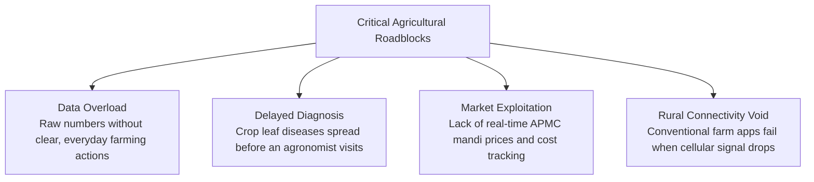
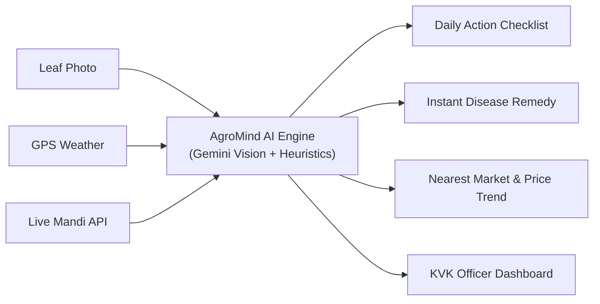

# AgroMind AI — ખેતીનું સ્માર્ટ મગજ
> **Autonomous Farm-to-Field Advisory and Action Orchestration Platform**  
> *Translating Complex Agricultural Data into Prioritized, Everyday Farming Actions.*

[](https://github.com/Xcoder-69/HACKFORGE)
[](#1-problem-statement)
[](https://react.dev/)
[](https://tailwindcss.com/)
[](https://ai.google.dev/)
[](https://supabase.com/)
[](https://data.gov.in/)

> **Looking for deep technical architecture, AI models & API specifications?**  
> See [WEB_APP_STRUCTURE.md](./WEB_APP_STRUCTURE.md) for full details on models, APIs, secure proxy design, and system architecture.

---

## Quick Summary for Hackathon Judges

| Evaluation Dimension | Hackathon Project Details |
|---|---|
| **Event & Track** | **Bit N Build '26 Gujarat** — **Problem Statement PS-6** |
| **Core Problem** | Farmers are bombarded with raw weather numbers, disease doubts, and mandi rate fluctuations, but lack a direct answer to: **"What exact action should I take in my field today?"** |
| **Our Solution** | **AgroMind AI**: An autonomous, location-aware digital agronomist that converts leaf scans, live weather telemetry, and APMC mandi rates into an **actionable daily checklist** with a dedicated **KVK Extension Officer Command Center**. |
| **AI Innovation** | **Google Gemini 3.8 Flash Vision** (with auto-fallback to `gemini-3.5-flash-lite`) for instant crop identification, growth stage estimation, disease pathology, and chemical/organic treatments — connected to live **Government Agmarknet Mandi API**. |
| **Security First** | **Zero Frontend Secrets**: API keys (`GEMINI_API_KEY`, `MANDI_API_KEY`) stay strictly backend-only via server proxy (`/api/ai/analyze-crop`). |
| **Offline Resilience** | **Zero-Disruption Offline Engine**: Full local functionality in remote fields without cellular internet; auto-syncs to **Supabase PostgreSQL** upon reconnection. |
| **Regional Language** | Trilingual interface: Native **Gujarati (ગુજરાતી)**, **Hindi (हिन्दी)**, and **English**, with an all-India 28-state administrative district selector. |
| **Judge Test PIN** | Mobile login: Enter any 10-digit number & use instant bypass PIN: **`8249`** (or real SMS OTP). |

---

## 1. Problem Statement

India is home to over 150 million farming families. Despite having smartphones, smallholder and marginal farmers face 4 critical roadblocks every single season:



1. **Information Overload without Actionable Clarity**: Farmers see metrics like *"Humidity 82%, Soil Moisture 24%"*, but no tool translates this into: *"Hold nitrogen spraying for 24 hours to prevent rain wash-off."*
2. **Devastating Disease Delays**: Getting an agricultural extension officer to physically inspect a diseased cotton or groundnut leaf takes days. By then, crop loss can reach 30% to 50%.
3. **Mandi Price Opacity & Middlemen Exploitation**: Without instant nearby APMC rates and harvest cost ledgers, farmers sell distress harvests to local intermediaries below market value.
4. **The Connectivity Void**: Traditional agricultural web applications freeze completely in remote rural fields where 4G/5G connectivity is weak or non-existent.

---

## 2. The Solution: AgroMind AI

**AgroMind AI** acts as a personal agronomist in the farmer's pocket. It bridges the gap between complex agricultural science and everyday field work.



### Core Value Proposition:
- **Instant Photo-to-Prescription**: Snap a picture of any crop to detect the crop variety, growth stage, disease symptoms, organic remedies, and chemical dosages.
- **Location-Based Market Intelligence**: Automatically connects the diagnosed crop to live government mandi rates and historical price trends in nearby APMCs.
- **Daily Action Plan**: Dynamic priority-ranked checklist (Irrigation, Spraying, Nutrient management) tailored to live environmental conditions.
- **Dual-Portal Ecosystem**: A dedicated **Farmer Mobile Hub** plus a **KVK Agronomist Command Center** for regional outbreak surveillance and emergency alerts.

---

## 3. Key Features

### 1. AI Crop Health Camera (`/ai-camera`)
- **Universal Crop Analysis**: Upload or capture a photo of *any* crop — completely independent of registered farm profile.
- **Multimodal Intelligence**: Powered by **Google Gemini 3.8 Flash** to identify:
  - Detected crop name, variety, and scientific name.
  - Visible condition (Healthy vs. Diseased / Pest Damaged).
  - Specific pest or pathogen (e.g., Pink Bollworm, Leaf Blight, Powdery Mildew).
  - Organic remedies and approved chemical treatments with exact dosages.
- **Live Mandi Integration**: Instantly fetches current APMC market prices, 7-day/30-day trends, and "Sell vs. Store" recommendations for the detected crop.
- **Progressive Loader**: Real 6-stage verification progress (Camera → Model → Symptoms → Knowledge Base → Mandi API → Action Plan).

### 2. Dynamic Farm & Parcel Management (`/home`)
- **Visual Block Mapping**: Manage distinct plots (`Block A`, `Block B`, `Block C`) with independent crop stages and soil moisture tracking.
- **At-a-Glance Telemetry**: Land acreage, soil classification, irrigation type, and Sentinel-2 NDVI satellite health index.

### 3. Daily Action Checklist & Alert Center (`/alerts`)
- Translates weather telemetry (rain forecasts, humidity, wind) into prioritized farming instructions:
  - *Spray Window Alerts* (e.g., "Wind speed favorable for spraying between 7 AM – 10 AM").
  - *Irrigation Triggers* (e.g., "Delay irrigation — 18mm rain expected tomorrow").

### 4. APMC Mandi Market Intelligence (`/market`)
- Direct integration with **Government Agmarknet Mandi API** (`api.data.gov.in`).
- 7,990+ historical commodity price records for 7-day and 30-day trend analysis.
- Haversine GPS formula to find the **nearest physical APMC market** and distance in kilometers.

### 5. Financial OpEx & Profit Ledger (`/expenses`, `/profit`)
- Easy mobile ledger for recording input costs: seeds, fertilizer, machinery, diesel, and labor.
- Automatically calculates the farmer's **Break-Even Price per Quintal** so they know their exact profit margin before negotiating with buyers.

### 6. Multilingual AI Assistant (`/ai-assistant`)
- Conversational agronomy chat assistant in Gujarati, Hindi, and English.
- Context-aware advice tailored to the farmer's specific crops and local soil type.
- Full offline fallback engine with pre-trained agronomic advisory rules.

### 7. KVK Extension Officer Command Center (`/admin`)
- Built for **Krishi Vigyan Kendra (KVK)** scientists and district agricultural officers.
- Real-time regional disease outbreak heatmaps and cluster surveillance.
- 1-click emergency SMS broadcast system to warn farmers in affected talukas.

---

## 4. Technology Stack

```text
┌─────────────────────────────────────────────────────────────┐
│                       AgroMind AI                           │
├──────────────────────────────┬──────────────────────────────┤
│ Frontend                     │ Backend & Services           │
│ • React 18 + Vite            │ • Vite Backend API Plugin    │
│ • TypeScript (Strict)        │ • Node.js Serverless Proxy   │
│ • Tailwind CSS               │ • Supabase PostgreSQL        │
│ • Lucide React Icons         │ • Firebase Auth (SMS OTP)    │
├──────────────────────────────┼──────────────────────────────┤
│ AI & Vision Models           │ External APIs & Data         │
│ • Google Gemini 3.8 Flash    │ • Government Agmarknet Mandi │
│ • Fallback: Gemini 3.5 Lite  │ • Open-Meteo Weather API     │
│ • Gemini Chat Assistant      │ • Historical APMC Dataset    │
└──────────────────────────────┴──────────────────────────────┘
```

> For full technical details, model schemas, and API contracts, refer to [WEB_APP_STRUCTURE.md](./WEB_APP_STRUCTURE.md).

---

## 5. Social and Economic Impact

```text
  ┌───────────────────────┐     ┌───────────────────────┐     ┌───────────────────────┐
  │  20% - 30% Savings    │     │  15% - 25% Yield Saved│     │  Fair Market Price    │
  │  on unnecessary       │ ──> │  through early AI leaf│ ──> │  via live APMC mandi  │
  │  chemical pesticides  │     │  pathogen detection   │     │  benchmarks & ledger  │
  └───────────────────────┘     └───────────────────────┘     └───────────────────────┘
```

- **Environmental Safety**: Prevents indiscriminate chemical spraying by providing organic first-line remedies and calibrated dosages.
- **Financial Protection**: Empowers marginal farmers with transparent APMC market data and break-even calculations to eliminate middlemen exploitation.
- **Bridging the Digital Divide**: Brings world-class Google DeepMind Gemini AI directly to rural farmers in their native tongue (**Gujarati** and **Hindi**) with zero internet dependency.

---

## 6. How to Run the Project (Quick Start)

### Prerequisites
- [Node.js](https://nodejs.org/) (v18 or higher)
- npm or yarn
- Google Gemini API Key ([Google AI Studio](https://aistudio.google.com/))

### 1. Clone & Install
```bash
git clone https://github.com/Xcoder-69/HACKFORGE.git
cd HACKFORGE
npm install
```

### 2. Configure Environment Variables
Copy `.env.example` to `.env`:
```bash
cp .env.example .env
```
Fill in your secrets:
```env
# Server-side secrets (never exposed to browser)
GEMINI_API_KEY=your_gemini_api_key_here
MANDI_API_KEY=your_data_gov_in_mandi_api_key_here

# Frontend variables
VITE_OPEN_METEO_BASE_URL=https://api.open-meteo.com/v1
VITE_ENABLE_OFFLINE_CACHE=true
```

### 3. Start Development Server
```bash
npm run dev
```
Open your browser at: `http://localhost:5173`

### 4. Evaluator Test Credentials & Demo Guide

#### A. Quick 1-Click Login (Pre-Configured Farm Profile)
Use this to immediately explore a fully loaded farm with plots, soil telemetry, crop stages, and financial records:
* **Mobile Number**: `9876543210` *(pre-filled on screen, or enter any 10-digit number)*
* **Login Method — OTP**: Enter **`8249`** *(in the OTP boxes — bypasses SMS verification)*
* **Login Method — PIN**: Switch tab to PIN and enter **`8249`**
* **Farmer Profile**: Rameshbhai Patel (Kamrej, Surat, Gujarat)
* **Active Plots**: Block A (Cotton BT-2, Flowering), Block B (Groundnut GG-20, Pod Formation)

#### B. New Farmer Registration (Test 4-Step Onboarding Wizard)
To test the onboarding flow from a fresh account:
1. Click **"New Farmer? Register"** on the login screen (or navigate to `/login?tab=register`).
2. Enter sample details:
   * **Full Name**: `Mahesh Patel` *(or any name)*
   * **Mobile Number**: Any 10-digit number, e.g. `9898989898` or `9123456789`
   * **District**: `Surat` *(or Rajkot, Junagadh, Vadodara)*
   * **Taluka / City**: `Kamrej` *(auto-cascades)*
   * **Village**: `Kamrej Gam` *(or custom village)*
3. Click **"Register & Continue"** to enter the **4-Step Farm Setup Wizard**:
   * **Step 1 (KYC)**: PM-KISAN ID `GJ-SUR-99001`
   * **Step 2 (GPS Tagging)**: Click *"Auto-Detect GPS Location"* (Surat: `21.1702° N, 72.8311° E`)
   * **Step 3 (Land & Soil)**: Acreage `5.0` Acres, Soil `Black Cotton Soil`, Irrigation `Drip`
   * **Step 4 (Crops)**: Choose Kharif/Rabi crops (`Cotton`, `Groundnut`, `Wheat`)

#### C. KVK Extension Officer (Admin Portal)
* **Direct URL**: `http://localhost:5173/admin`
* **Access**: Click **"Switch to Admin"** button at the top/bottom of any screen.
* **Test Capabilities**: Regional disease outbreak heatmaps, cluster surveillance by taluka, and mass emergency SMS broadcast dispatch.

---

## 7. Project Documentation

- [README.md](./README.md) — Main Project Pitch, Problem Statement & Overview *(this file)*
- [WEB_APP_STRUCTURE.md](./WEB_APP_STRUCTURE.md) — Technical Stack, Models, APIs, Security Proxy & Architecture
