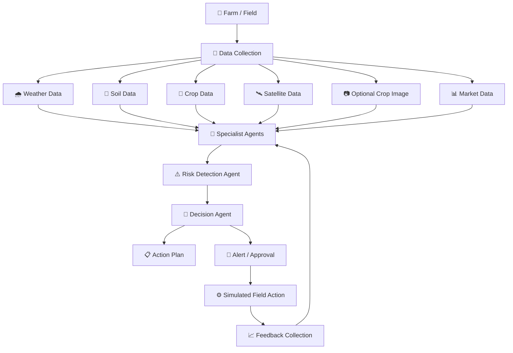

# 🌾 AgroMind AI
> **"From Soil Insights to Smarter Harvests."**  
> An autonomous, location-aware farm advisory and action orchestration web platform built for **Bit N Build'26 Gujarat**.

[](#-team--hackathon)
[](#1--the-problem)
[](https://nextjs.org/)
[](https://ai.google.dev/)
[](https://open-meteo.com/)
[](https://supabase.com/)

---

## 📌 Executive Summary (For Judges & Evaluators)

| Question | Evaluation Answer |
|---|---|
| **Hackathon Event** | **Bit N Build'26 Gujarat** |
| **Problem Statement** | **PS-6: Autonomous Farm-to-Field Advisory & Action Orchestration Agents** |
| **The Core Problem** | Agricultural information is fragmented; farmers get confusing weather charts and soil reports without knowing what specific actions to take today. |
| **What We Built** | A responsive, mobile-first web application that converts live weather, soil telemetry, AI crop disease scans, and market prices into an **automated, prioritized daily farming checklist**. |
| **Key Innovation** | **Hybrid Decision Engine**: Combines deterministic agronomic safety rules with **Google Gemini 1.5 Vision**, translating environmental data into executable tasks rather than passive graphs. |

---

## 1. 🛑 The Problem

Small- and mid-scale farmers encounter four critical challenges every season:

1. **Information Fragmentation & Confusion**: Weather apps show barometric pressure and humidity curves; soil labs give chemical ratios in kg/ha. Farmers struggle to translate raw scientific numbers into everyday farming decisions.
2. **Delayed Crop Disease Diagnosis**: When crop leaves show spots or yellowing, consulting an agronomist or visiting a local Krishi Vigyan Kendra (KVK) takes days. By then, fungal blights and pest infestations spread irreversibly across the field.
3. **Hidden Cultivation Expenses & Middlemen Exploitation**: Farmers rarely calculate exact operational expenses (seeds, diesel, labor, machinery lease). Lacking real-time visibility into benchmark Mandi (APMC) prices, they often sell at a loss to local middlemen.
4. **Lack of Action Orchestration**: Knowing that rain is coming is incomplete. Farmers need prioritized, timed actions: *"Delay foliar pesticide spray by 48 hours; clear drainage trench #2 today."*

---

## 2. 💡 The Solution

**AgroMind AI** functions as an autonomous digital agronomist on the farmer's smartphone. It ingests environmental data, evaluates crop risks, and produces a simple, prioritized daily action plan:



---

## 3. 📱 The Product: What It Does (Screen-by-Screen)

The AgroMind AI website consists of six core modules:

### 1. 📍 Farm Onboarding & Location Setup (`/`)
- One-click **Browser Geolocation**: Automatically captures the farm's latitude and longitude without manual typing.
- Captures field size (acres), primary soil type (Loamy, Clayey, Black Cotton, Sandy), and irrigation source.
- Sets current crop and growth stage (Sowing, Vegetative, Flowering, Fruiting, Harvest).

### 2. 🌤️ Smart Dashboard & Weather Intelligence (`/dashboard`)
- Fetches real-time temperature, humidity, rain probability, and wind metrics using **Open-Meteo**.
- **Action Translation**: Converts forecasts into immediate instructions (e.g., *"75% rain probability tomorrow — hold urea fertilizer application to prevent nutrient runoff"*).
- Displays top-priority warning banners for heat stress, frost, or waterlogging risks.

### 3. 🧪 Soil Insights & Interactive Sensor Simulator (`/soil`)
- **Dual Ingestion**: Farmers can enter physical Soil Health Card values manually or test via the **interactive demo sensor slider**.
- Tracks Moisture %, pH, and N-P-K nutrient levels with instant color-coded status badges.
- Moving the demo slider from 40% to 15% immediately triggers an automated *"Water Deficit Stress"* alert.

### 4. 📸 Smart Crop Camera / Leaf Pathology Scanner (`/camera`)
- Farmers take a picture or upload a photo of a damaged crop leaf directly from their phone camera.
- **Google Gemini 1.5 Vision** analyzes visual symptoms (chlorosis, necrotic spots, powdery mildew).
- Delivers:
  - Probable observation and confidence score (e.g., *Early Leaf Spot — 84% confidence*).
  - Safe cultural and mechanical remedies (spacing, leaf sanitation, drip management).
  - Safety alert: *"Advisory only — consult an agricultural extension officer before chemical use."*

### 5. 💰 Cultivation Cost Calculator & Market Margins (`/calculator`)
- Breaks down exact seasonal Operational Expenditure (OpEx): Seeds, land prep, fertilizer, irrigation power, hired labor, and machinery.
- Calculates **Total Cost**, **Cost per Acre**, and **Break-Even Unit Price**.
- Pulls benchmark **Mandi (APMC) market rates** to project expected harvest revenue and net profit margins.

### 6. 📋 Action Center & Task Orchestrator (`/tasks`)
- Automatically compiles weather alerts and crop camera diagnoses into a daily to-do checklist.
- Tasks are categorized by priority (High, Medium, Low) with due dates and estimated intervention costs.
- Farmers mark tasks as completed, generating an auditable seasonal field history.

---

## 4. 🛠️ Technology Stack: Where Each Technology is Used

Here is exactly how and where each technology is utilized across the AgroMind AI website:

```text
                                WEBSITE ARCHITECTURE (BROWSER)
  ┌────────────────────────────────────────────────────────────────────────────────────────┐
  │  Next.js 14 + React + Tailwind CSS (Responsive Mobile UI, High-Contrast Cards, Icons)  │
  └───────────────────────────────────────────┬────────────────────────────────────────────┘
                                              │
                   ┌──────────────────────────┴──────────────────────────┐
                   ▼                                                     ▼
     ┌───────────────────────────┐                         ┌───────────────────────────┐
     │      CLIENT FEATURES      │                         │     SERVER API ROUTES     │
     │  - Browser Geolocation    │                         │   (Next.js Route Handlers)│
     │  - Recharts (Visual Data) │                         │   - Zod Input Validation  │
     │  - HTML5 Camera Capture   │                         │   - Secret Key Protection │
     └─────────────┬─────────────┘                         └─────────────┬─────────────┘
                   │                                                     │
                   │                                ┌────────────────────┼────────────────────┐
                   ▼                                ▼                    ▼                    ▼
        ┌─────────────────────┐          ┌────────────────────┐ ┌─────────────────┐ ┌─────────────────┐
        │   Open-Meteo API    │          │  Google Gemini AI  │ │  Supabase DB    │ │ Supabase Storage│
        │  Live Weather Data  │          │  Leaf Diagnosis &  │ │  (PostgreSQL)   │ │ (Private Photos)│
        │  (Rain, Temp, Wind) │          │  Advisory Actions  │ │  Farmer Records │ │ Leaf Images     │
        └─────────────────────┘          └────────────────────┘ └─────────────────┘ └─────────────────┘
```

| Technology | Category | Where It Is Used in the Website |
|---|---|---|
| **Next.js 14 (App Router)** | Web Framework | Powers the entire web application, frontend page routes (`/`, `/dashboard`, `/camera`, `/calculator`, `/tasks`), and server-side API handlers. |
| **React 18 + TypeScript** | UI & Logic | Provides interactive client state (sensor sliders, task toggles, camera stream) with strict end-to-end type safety. |
| **Tailwind CSS** | Styling System | Styles every component with a clean, high-contrast, mobile-first design optimized for outdoor smartphone visibility. |
| **Lucide React** | UI Icons | Delivers clear visual symbols (sun, leaf, camera, rupee) allowing farmers with lower literacy to navigate effortlessly. |
| **Recharts** | Data Visualization | Renders intuitive charts on `/dashboard` and `/calculator` (7-day weather trend lines, OpEx expense pie charts). |
| **Google Gemini 1.5 Vision** | AI Engine | Powers `/camera` — analyzes uploaded leaf photos, recognizes pest/disease symptoms, and returns structured diagnosis observations. |
| **Google Gemini 1.5 Flash** | AI Engine | Powers `/advisory` — generates plain-language, contextual action summaries based on farm conditions. |
| **Open-Meteo Weather API** | Meteorological Data | Powers `/dashboard` and `/api/weather` — fetches live temperature, humidity, and rainfall probability via coordinates without API keys. |
| **Supabase (PostgreSQL)** | Database | Persists farmer profiles, farm boundaries, soil readings, and daily tasks with **Row Level Security (RLS)**. |
| **Supabase Storage** | Object Storage | Encrypted cloud bucket that stores uploaded leaf photos securely with short-lived access tokens. |
| **Browser Geolocation API** | Native Web API | Powers the *"Detect My Location"* button on `/` to retrieve GPS coordinates instantly via `navigator.geolocation`. |
| **Zod** | Schema Validation | Runs on server-side Next.js routes to strictly validate form payloads and ensure AI outputs match our required JSON format. |
| **Vercel** | Cloud Deployment | Hosts the production web application with global edge distribution and automated SSL. |

---

## 5. 🌐 APIs & Integrations Breakdown

| Integration | Endpoint / Interface | Purpose & Data Flow |
|---|---|---|
| **Open-Meteo Weather** | `GET https://api.open-meteo.com/v1/forecast` | Client provides latitude & longitude ➔ Open-Meteo returns 7-day hourly temperature, humidity, precipitation probability, and wind speed. Cached for 30 minutes. |
| **Google Gemini API** | `POST /api/ai/crop-analysis` | Client uploads leaf photo ➔ Server forwards base64 image + prompt to Gemini Vision ➔ Returns structured JSON containing health status, observed symptoms, and cultural remedies. |
| **Supabase Auth & DB** | `@supabase/supabase-js` | Handles user authentication and executes CRUD operations on PostgreSQL tables (`farms`, `soil_readings`, `tasks`) secured by RLS policies. |
| **Supabase Storage** | S3-compatible REST API | Stores raw uploaded leaf photos into a private `crop-images` bucket. |
| **Mandi Price Feed** | `/data/mandi_prices.json` (Demo API) | Provides benchmark Minimum, Maximum, and Modal prices per quintal for major crops across regional APMC markets. |

---

## 6. 🚀 Quick Start (Run Locally)

### 1. Clone the Repository
```bash
git clone https://github.com/Xcoder-69/HACKFORGE.git
cd HACKFORGE
```

### 2. Switch to Your Personal Branch
```bash
# Work on your dedicated team branch:
git checkout mahendra   # or: pranav, darshil, chetan
```

### 3. Install Dependencies
```bash
npm install
```

### 4. Configure Environment Variables
Create a `.env.local` file in the project root:
```env
NEXT_PUBLIC_SUPABASE_URL=https://your-project.supabase.co
NEXT_PUBLIC_SUPABASE_ANON_KEY=your_supabase_anon_key
GEMINI_API_KEY=your_google_gemini_api_key
```

### 5. Start the Development Server
```bash
npm run dev
```
Open [http://localhost:3000](http://localhost:3000) in your browser!

---

## 7. 👥 Team & Hackathon Information

- **Hackathon**: **Bit N Build'26 Gujarat**  
- **Problem Statement**: **PS-6 (Autonomous Farm-to-Field Advisory & Action Orchestration Agents)**  
- **Team**: **HACKFORGE**

| Team Member | Role | Key Responsibilities |
|---|---|---|
| **Mahendra Suryavanshi** | Team Lead & Full-Stack Integration | System architecture, Next.js API routes, team coordination |
| **Pranav** | AI Advisory & Vision Integration | Gemini prompt engineering, vision schema validation, AI safety |
| **Darshil** | Backend & Database Architect | Supabase PostgreSQL schema, RLS policies, seed datasets |
| **Chetan** | Frontend & UI/UX Developer | Responsive dashboard, camera scanner UI, mobile aesthetics |

---

## 8. 🛡️ Responsible AI & Safety Note

> **Disclaimer**: AgroMind AI is an educational, decision-support advisory tool.
> - Observations from the AI camera are probabilistic visual hypotheses, not certified laboratory diagnoses.
> - The platform **never prescribes restricted chemical pesticides or hazardous dosages**; it prioritizes non-chemical cultural sanitation and safe field practices.
> - In cases of severe crop damage or high diagnostic uncertainty, the platform explicitly directs farmers to consult certified agricultural extension officers (KVKs).
