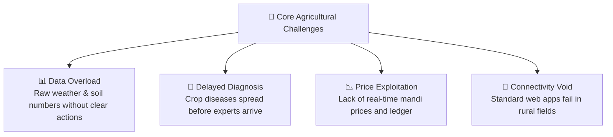
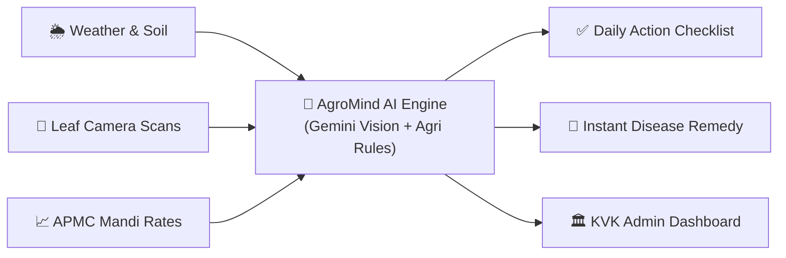
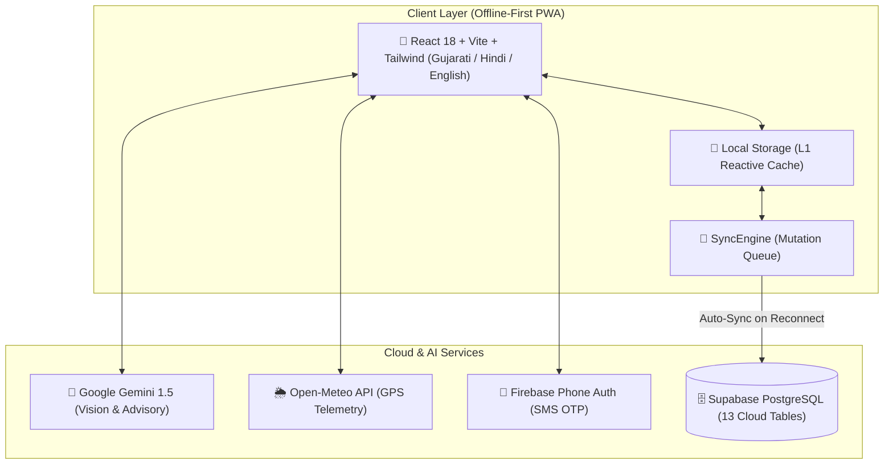
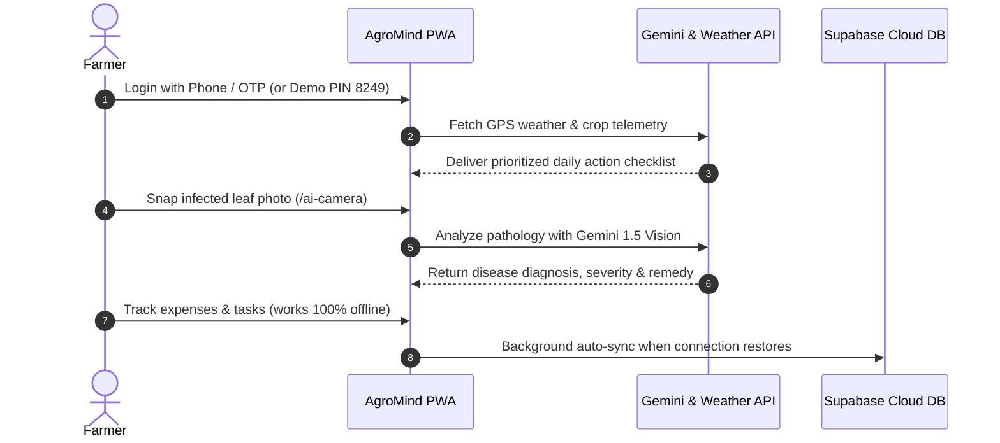

# AgroMind AI — ખેતીનું સ્માર્ટ મગજ
> **Autonomous Farm-to-Field Advisory and Action Orchestration Platform**  
> *Translating Complex Environmental Data into Prioritized, Everyday Farming Actions.*

[](https://github.com/Xcoder-69/HACKFORGE)
[](#1-problem-statement)
[](https://react.dev/)
[](https://tailwindcss.com/)
[](https://ai.google.dev/)
[](https://supabase.com/)
[](https://open-meteo.com/)
[](https://firebase.google.com/)

> **Looking for technical architecture & feature flow?** See [APP_STRUCTURE.md](./APP_STRUCTURE.md) for detailed AI model schemas, authentication mechanics, trained heuristics, and geolocation specifications.

---

## Quick Pitch for Judges (At a Glance)

| Criteria | Hackathon Evaluation Summary |
|---|---|
| **Event and Track** | **Bit N Build '26 Gujarat** — **Problem Statement PS-6** |
| **Core Problem** | Farmers are overwhelmed with raw weather metrics, soil lab reports, and complex market charts without knowing: **"What exact action should I take in my field today?"** |
| **Our Solution** | An autonomous, location-aware digital agronomist that converts GPS weather, soil telemetry, AI crop camera scans, and mandi prices into a **clear, prioritized daily checklist** with a dedicated **KVK Agronomist Command Center**. |
| **Key Innovation** | **Hybrid Decision Engine**: Integrates deterministic agronomic rules with **Google Gemini 1.5 Vision** for instant crop leaf pathology diagnosis and real-time Gujarati/Hindi conversational advisory. |
| **Offline Resilience** | **Zero-Disruption Offline Engine**: Full functionality in rural fields without connectivity; auto-syncs to **Supabase PostgreSQL** when connection returns. |
| **Regionalization** | Native support for **Gujarati (ગુજરાતી)**, **Hindi (हिन्दी)**, and **English**, complete with an all-India 28-state cascading administrative selector. |

---

## 1. Problem Statement

Indian agriculture supports over 150 million farming households, yet smallholder and marginal farmers face four systemic roadblocks every season:



1. **Information Overload without Actionable Clarity**: Farmers receive raw numbers (humidity 78%, barometric pressure 1012 hPa), but nobody tells them: *"Hold nitrogen fertilizer application for 36 hours to prevent nutrient runoff."*
2. **Devastating Crop Pathogen Delays**: When yellow spots or necrotic lesions appear on cotton or groundnut leaves, getting physical agricultural officer consultation takes days. By then, yield loss exceeds 30-50%.
3. **Financial OpEx Opacity and Middlemen Exploitation**: Farmers rarely track input costs (seeds, diesel, labor, tractor rental) in a structured ledger. Lacking daily APMC benchmark prices, they sell to middlemen at steep discounts.
4. **The Connectivity Void**: Traditional agricultural web tools fail completely when cellular networks drop in remote rural fields.

---

## 2. The Solution: AgroMind AI

**AgroMind AI** acts as an **autonomous digital agronomist** directly in the farmer's pocket. It aggregates hyperlocal atmospheric intelligence, parcel-level soil metrics, visual pathology, and market data, converting them into an **automated daily farming action plan**.



### Key Capabilities:
- **Dual-Portal Architecture**:
  - **Farmer Application**: Mobile-first dashboard with interactive parcel management, AI leaf disease diagnostics, APMC price trends, financial accounting, and voice/chat AI advisory.
  - **KVK Admin Command Center**: Regional cluster overview, pest outbreak heatmaps, and mass emergency broadcast alerts for extension officers.
- **Dynamic Parcel Management**: Custom block mapping (`Block A`, `Block B`, `Block C`, etc.) with individual crop lifecycles and soil moisture tracking.
- **Verified KYC Integration**: PM-KISAN linking, Aadhaar/phone verification, and survey/khata number mapping.

---

## 3. System Architecture

AgroMind AI is engineered as a high-performance, offline-first Progressive Web Application backed by modern cloud services:



### Architectural Highlights:
1. **L1 + L2 Persistence**: All farmer state is instantly written to reactive local storage (L1) for zero-latency UI rendering, then queued in `SyncEngine` and flushed to Supabase PostgreSQL (L2) with optimistic background sync.
2. **13 Relational Cloud Tables**: Fully structured PostgreSQL backend covering `profiles`, `farms`, `plots`, `crops`, `expenses`, `revenues`, `diagnoses`, `crop_scans`, `alerts`, `mandi_prices`, `chat_messages`, `user_preferences`, and `sync_queue`.
3. **Edge Multilingual Engine**: Dynamic translation architecture rendering native Gujarati, Hindi, and English without layout reflows.

---

## 4. Web Application Workflow and User Journey



### Complete Screen-by-Screen Breakdown:

| # | Route | Screen Name | Key Features |
|---|---|---|---|
| 1 | `/` | **Language Selection and Welcome** | Select Gujarati (`ગુજરાતી`), Hindi (`हिन्दी`), or English with high-contrast, accessible cards. |
| 2 | `/login` | **Authentication Hub** | Tab 1: Fast Login via Phone + Firebase 6-digit SMS OTP (or Demo PIN `8249`).<br>Tab 2: New Farmer Registration with All-India 3-Tier Cascading District -> City -> Village selector. |
| 3 | `/onboarding` | **4-Step Farm Setup Wizard** | Guided setup: (1) KYC and PM-KISAN, (2) One-tap GPS Geolocation, (3) Land acreage, soil classification and irrigation, (4) Kharif/Rabi crop planting. |
| 4 | `/home` | **My Farm Dashboard** | Farmer profile card with 4 telemetry chips (Land, Soil, Drip Irrigation, Satellite NDVI), **interactive Parcel Map** supporting dynamic plots (`Block A`, `Block B`, `Block C`, etc.), active crop tickers, and quick shortcuts. |
| 5 | `/recommendations` | **Crop Intelligence** | Soil-matched crop recommendation matrix, duration, water requirements, estimated profit per acre, and stage-by-stage growth plans. |
| 6 | `/weather-soil` | **Weather and Soil Telemetry** | Hyperlocal Open-Meteo GPS forecasts, 7-day hourly rain graphs, temperature, humidity, and agro-advisories. |
| 7 | `/ai-camera` | **AI Leaf Disease Scanner** | Live phone camera capture or photo upload. Google Gemini Vision identifies diseases (e.g., *Early Leaf Spot, Powdery Mildew, Leaf Curl*), confidence %, and remedies. |
| 8 | `/market` | **APMC Mandi Market Prices** | Real-time commodity prices across Gujarat and India markets, modal rates, daily trends, and "Sell vs. Store" decision support. |
| 9 | `/expenses` and `/profit` | **Farm Input Ledger and Profit** | Track seasonal OpEx (fertilizer, seeds, diesel, labor). Computes cost per acre, break-even unit cost, and net harvest profit margin. |
| 10 | `/alerts` | **Action Center and To-Do Checklist** | Automated prioritized tasks generated from weather threats and disease scans. Mark tasks completed to build a field history. |
| 11 | `/ai-assistant` | **Conversational AI Agronomist** | Interactive multilingual AI chat offering contextual advice tailored to the farmer's active crops and soil. |
| 12 | `/admin` | **KVK Officer Command Center** | Multi-farmer surveillance dashboard, regional disease outbreak heatmaps, and mass emergency SMS broadcast transmitter. |

---

## 5. Technology Stack

| Domain | Technology | Implementation Details |
|---|---|---|
| **Core Frontend** | **React 18** + **TypeScript** | Strict type contracts (`farm.contract.ts`, `sync.contract.ts`, `api.contract.ts`) ensuring 0 runtime type errors. |
| **Build Tool** | **Vite 6** | Ultra-fast Hot Module Replacement (HMR) and optimized single-page production bundling. |
| **Styling** | **Tailwind CSS 3** | Mobile-first, outdoor-optimized design system featuring high-contrast palettes, smooth micro-interactions, and clean layouts. |
| **Artificial Intelligence** | **Google Gemini 1.5 Vision and Flash** | Multimodal disease recognition from mobile camera images + contextual agronomic advisory synthesis. |
| **Cloud Database** | **Supabase PostgreSQL** | 13 production tables with foreign key constraints, indexes, and Row Level Security (RLS). |
| **Authentication** | **Firebase Phone Telephony** | Real Indian (+91) SMS OTP delivery + instant demo passkey bypass (`8249`) for judge evaluations. |
| **Meteorological Data** | **Open-Meteo Weather API** | GPS-driven atmospheric telemetry with zero API key restrictions and 30-minute intelligent caching. |
| **State and Offline Sync** | **Dual-Layer SyncEngine** | Custom event-driven storage service managing reactive local storage with background reconciliation on reconnect. |
| **Geography Dataset** | **Custom India Geo Engine** | Hierarchical cascading database covering all 28 States and 8 Union Territories down to talukas and villages. |

---

## 6. Key Innovations and Differentiators

```text
+----------------------------------------------------------------------------------+
|                             WHAT SETS AGROMIND AI APART                          |
+--------------------------------+-------------------------------------------------+
| Traditional Agri Apps          | AgroMind AI (Bit N Build '26)                   |
+--------------------------------+-------------------------------------------------+
| Complex scientific charts      | Direct, prioritized action checklist            |
| English / Hindi only           | Native Gujarati (ગુજરાતી) + Hindi + English     |
| Crashes when internet drops    | 100% operational offline with automatic sync     |
| Generic weather notifications  | Action translation: "Hold spray for 36 hours"   |
| Days to consult an expert      | Instant Gemini Vision diagnosis in 3 seconds    |
| Uncalculated farming expenses  | Full seasonal OpEx ledger and break-even pricing|
| Farmer-only perspective        | Dual-role: Farmer App + KVK Command Center      |
+--------------------------------+-------------------------------------------------+
```

1. **Autonomous Action Translation Engine**: Rather than displaying *"Humidity 85%, Rain 18mm"*, AgroMind AI translates it into: *"High risk of fungal spores. Postpone foliar urea spray by 48 hours; clear drainage channel #2."*
2. **True Offline-First Architecture**: Built specifically for rural India where network dropouts are common. Farmers can log expenses, check cached weather, review plots, and queue scans offline.
3. **Dynamic Multi-Plot Parcel Map**: Seamlessly add, monitor, and configure multiple farm blocks (`Block A: Cotton`, `Block B: Groundnut`, `Block C: Wheat`) with independent telemetry and acreage tracking.

---

## 7. Quick Start (Run Locally)

### 1. Prerequisites
- **Node.js**: v18.0 or higher
- **npm**: v9.0 or higher

### 2. Clone and Install
```bash
git clone https://github.com/Xcoder-69/HACKFORGE.git
cd HACKFORGE
npm install
```

### 3. Environment Configuration
Create a `.env` file in the project root (a `.env.example` is provided):
```env
# Supabase Cloud Database (Pre-configured)
VITE_SUPABASE_URL=https://ncrwfvzppewwrmjfxszf.supabase.co
VITE_SUPABASE_ANON_KEY=eyJhbGciOiJIUzI1NiIsInR5cCI6IkpXVCJ9...

# Google Gemini AI API
VITE_GEMINI_API_KEY=your_gemini_api_key_here

# Firebase Phone Auth (Optional: Demo PIN 8249 works out of the box)
VITE_FIREBASE_API_KEY=your_firebase_key
VITE_FIREBASE_AUTH_DOMAIN=your_project.firebaseapp.com
VITE_FIREBASE_PROJECT_ID=your_project_id
```

### 4. Run the Application
```bash
npm run dev
```
Open your browser at **`http://localhost:5173`**!

### 5. Instant Demo Credentials for Judges:
- **Phone Number**: Any 10-digit Indian phone (e.g. `9876543210`)
- **Quick Demo Passkey / PIN**: `8249` *(Bypasses SMS wait time for instant judge evaluation)*
- **KVK Admin Portal**: Directly access `/admin` or click *"KVK Admin Portal"* on the login page.

---

## 8. Team HACKFORGE

Built for **Bit N Build '26 Gujarat**:
- **Mahendra Suryavanshi** — Full-Stack Architecture, Offline SyncEngine and State Management
- **Pranav** — Frontend Engineering, UI/UX and Responsive Components
- **Darshil** — AI Integration, Gemini Vision Pathology and API Orchestration
- **Chetan** — Database Design, Supabase Schemas and Geographic Datasets

---

<div align="center">
  <sub>AgroMind AI — Empowering Indian Kisan with Autonomous Intelligence. Bit N Build '26 Gujarat.</sub>
</div>
