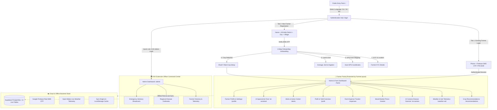

# AgroMind AI — Website & Application Structure

---

## 1. Authentication & Onboarding Layer

| Route | Page / Screen | Description |
| :--- | :--- | :--- |
| `/` | **Welcome & Language Selection** | Initial landing screen. Choose Gujarati (ગુજરાતી), Hindi (हिन्दी), or English. |
| `/login` | **Unified Login & Registration** | **Tab 1 (Login):** Enter registered phone number + Firebase 6-digit real SMS OTP or demo PIN `8249`. **Tab 2 (Register):** Full Name, Phone, and 3-Tier Cascading District $\rightarrow$ City $\rightarrow$ Village selector. |
| `/onboarding` | **4-Step Farm Setup Wizard** | Completed once after initial registration: 1. KYC & Location verification 2. GPS farm geolocation tagging 3. Land acreage, soil type, and irrigation source 4. Seasonal crop selection |

---

## 2. Farmer Core Application (`/home` — Protected)
Wrapped in responsive **`FarmerLayout`** (collapsible desktop sidebar on $\ge$ 1024px; top header, compact slide-over drawer, and bottom navigation bar on mobile).

| Route | Screen Name | Key Features |
| :--- | :--- | :--- |
| `/home` | **My Farm Dashboard** | Farm telemetry overview, weather widget, Plot A & B progress trackers, quick action shortcuts. |
| `/recommendations` | **Crop Intelligence** | AI crop suitability matrix, water requirement index, expected profit margins, growth stage schedules. |
| `/weather-soil` | **Weather & Soil Telemetry** | Real-time Open-Meteo GPS data, 7-day hourly rainfall forecast, temperature, humidity, and agro-advisories. |
| `/ai-camera` | **Crop Health Scanner** | Take or upload leaf photo; instant AI pathology diagnosis, severity ranking, and chemical/organic treatments. |
| `/market` | **Mandi Market Rates** | Live APMC mandi crop prices across Gujarat & India, modal prices, daily trends, and "Sell Now vs. Hold" recommendations. |
| `/expenses` | **Farm Input Expense Tracker** | Record expenditures (seeds, fertilizer, labor, machinery, irrigation), category breakdown, and ledger history. |
| `/profit` | **Profit & Yield Overview** | Crop harvest records, market revenue vs. input expenses, net income calculation. |
| `/alerts` | **Alerts & Action Center** | Urgent weather alerts, pest infestation warnings, irrigation reminders, and actionable field tasks. |
| `/ai-assistant` | **Conversational AI Agronomist** | Multilingual chat advisory powered by contextual farm and crop parameters. |
| `/profile` | **Farmer Account & Settings** | Edit farmer details, PM-KISAN linking ID, security PIN updates, and notification toggles. |

---

## 3. KVK Agronomist Command Center (`/admin` — Protected)

| Route | Screen Name | Key Features |
| :--- | :--- | :--- |
| `/admin` | **KVK Admin Command Center** | Multi-farmer monitoring, cluster soil and moisture telemetry, regional outbreak heatmaps, and mass emergency broadcast SMS. |

---

## 4. Backend & Data Integration Layer

- **Supabase PostgreSQL Cloud Database**: 13 tables (`profiles`, `farms`, `plots`, `crops`, `expenses`, `revenues`, `diagnoses`, `crop_scans`, `alerts`, `mandi_prices`, `chat_messages`, `user_preferences`, `sync_queue`).
- **Google Firebase Phone Telephony**: Authentic 6-digit SMS OTP verification for any Indian mobile phone number (`+91`).
- **Open-Meteo Weather API**: Live, GPS-accurate hourly atmospheric & soil telemetry without API key limits.
- **Offline-First Resilience**: `syncEngine.ts` automatically stores mutations locally and syncs them to the cloud database when online.
