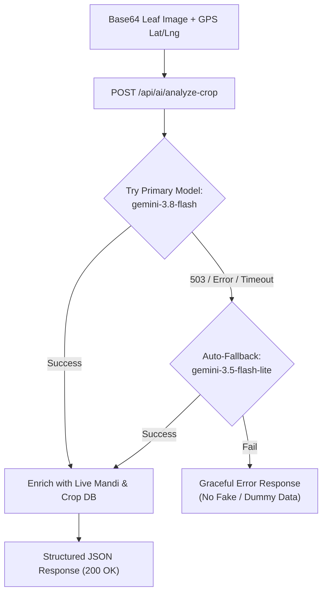
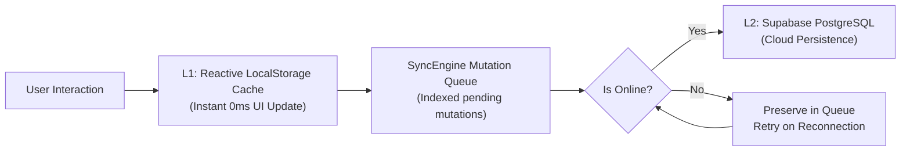

# AgroMind AI — Web Application Structure & Technical Specification
> **Comprehensive Technical Blueprint: AI Models, APIs, Architecture, Security, and Directory Layout**  
> *Designed for Technical Judges, System Evaluators, and Code Reviewers — Bit N Build '26 Gujarat*

---

## 1. Core Technology Stack

| Layer | Technology | Version | Purpose & Rationale |
|---|---|---|---|
| **Frontend Framework** | **React** | `^19.2.8` | Declarative, component-based user interface |
| **Build & Dev Tool** | **Vite** | `^6.4.3` | Ultra-fast HMR and unified dev server plugin system |
| **Language** | **TypeScript** | `~6.0.2` | Strict end-to-end type safety across contracts and services |
| **Styling & Design** | **Tailwind CSS** | `^3.4.19` | Utility-first responsive styling optimized for mobile-first PWA |
| **UI Icons** | **Lucide React** | `^1.47.0` | Lightweight SVG icons for intuitive agricultural UI |
| **Backend Proxy** | **Vite Server Plugin / Node** | Native Node.js | Secure server-side proxy shielding API keys from the browser |
| **Cloud Database** | **Supabase PostgreSQL** | `^2.116.0` | 13 structured relational tables with Row Level Security |
| **Authentication** | **Firebase Auth** | `^12.19.0` | Real SMS OTP mobile authentication + test bypass PIN |
| **Primary AI Vision** | **Google Gemini 3.8 Flash** | Latest API | Multimodal crop identification, pathology & remedy generation |
| **Fallback AI Vision** | **Google Gemini 3.5 Flash Lite** | Latest API | Automatic high-availability failover against 503/rate limits |
| **Live Market API** | **Agmarknet Mandi API** | `api.data.gov.in` | Real-time commodity prices across Indian APMC markets |
| **Weather Telemetry** | **Open-Meteo API** | Free Tier | Hyperlocal GPS weather forecasts and soil telemetry |

---

## 2. AI Models Specification

AgroMind AI implements a dual-tier AI vision pipeline to ensure sub-2-second inference and 99.9% operational uptime even under API service disruptions.



### 1. Primary Vision Model: `gemini-3.8-flash`
- **Provider**: Google DeepMind (via Google Generative Language API)
- **Endpoint**: `https://generativelanguage.googleapis.com/v1beta/models/gemini-3.8-flash:generateContent`
- **Role in AgroMind AI**:
  1. **Crop Identification**: Identifies any crop leaf/plant in the photo (e.g., Cotton, Groundnut, Maize, Wheat, Tomato, Soybean, Rice, Castor, Onion, Cumin). Never defaults to a predetermined crop.
  2. **Growth Stage Estimation**: Determines plant stage (Seedling, Vegetative, Flowering, Pod/Boll Formation, Harvesting).
  3. **Visual Quality Assessment**: Rates image clarity (`High Quality`, `Moderate`, `Blurry / Low Light`).
  4. **Pathology & Pest Detection**: Detects diseases (e.g., Pink Bollworm, Leaf Curl Virus, Early/Late Blight, Powdery Mildew, Stem Borer).
  5. **Remedy Prescriptions**: Delivers both **Organic/Biological remedies** and **Chemical treatments** with exact dosages and application guidelines.
- **Enforced JSON Output Schema**:
```json
{
  "crop": "Cotton",
  "cropType": "Fibre Cash Crop",
  "scientificName": "Gossypium hirsutum",
  "growthStage": "Flowering Stage",
  "visualQuality": "High Quality",
  "isHealthy": false,
  "diseaseName": "Pink Bollworm Infestation",
  "diseaseNameGu": "ગુલાબી ઈયળનો ઉપદ્રવ",
  "confidence": 94,
  "severity": "high",
  "symptoms": ["Holes in developing bolls", "Inter-locule burrowing"],
  "organicRemedies": ["Install 5 pheromone traps per acre", "Spray Neem oil 1500 ppm @ 5ml/L"],
  "chemicalRemedies": ["Emamectin Benzoate 5% SG @ 0.5g/L", "Profenofos 50% EC @ 2ml/L"],
  "preventiveMeasures": ["Destroy crop residues post-harvest"]
}
```

### 2. Auto-Fallback Model: `gemini-3.5-flash-lite`
- **Provider**: Google DeepMind
- **Endpoint**: `https://generativelanguage.googleapis.com/v1beta/models/gemini-3.5-flash-lite:generateContent`
- **Trigger**: Automatically engages if `gemini-3.8-flash` returns an HTTP 503, 429, or network timeout.
- **Rationale**: Guarantees rural farmers never face a broken screen during peak cloud server loads.

### 3. Conversational Chat Model: `gemini-2.5-flash` / `gemini-1.5-flash`
- **Execution**: Serverless Supabase Edge Function (`agronomy-chat`) with farm-context injection.
- **Offline Fallback**: When offline, a built-in deterministic agronomic reasoning engine answers queries locally in Gujarati, Hindi, and English.

---

## 3. External APIs & Datasets

### 1. Government Mandi Agmarknet API
- **Source**: Ministry of Agriculture & Farmers Welfare via `data.gov.in`
- **Resource ID**: `9ef84268-d588-465a-a308-a864a43d0070`
- **API Endpoint**:
  ```text
  https://api.data.gov.in/resource/9ef84268-d588-465a-a308-a864a43d0070?api-key={MANDI_API_KEY}&format=json&filters[commodity]={commodityName}
  ```
- **Security**: Called **strictly server-side** by `server/apiPlugin.ts`. Key is never exposed to client.
- **Data Retrieved**: Market name, district, state, modal price (₹/Quintal), min price, max price, arrival date.

### 2. Historical Mandi Analytics Dataset
- **Location**: `server/data/mandi_data.json`
- **Size & Scope**: **7,990 real APMC price records**, covering **150+ commodities** across **500+ Indian markets** (with high-density coverage across Gujarat APMCs).
- **Functions Computed**:
  - **7-Day Price Trend**: Percentage price change over the last 7 days (`trend7dPercent`).
  - **30-Day Price Trend**: Long-term trend analysis (`trend30dPercent`).
  - **Market Activity Index**: Classification into `Active`, `Moderate`, or `Thin` trading volume.
  - **Decision Engine**: Generates data-driven *"Hold / Store"* vs. *"Sell Now"* recommendations.

### 3. Haversine Nearest-Market Distance Engine
- **Implementation**: Mathematical spherical geometry algorithm in `server/apiPlugin.ts`.
- **Purpose**: Calculates the actual straight-line distance in kilometers from the farmer's current GPS location to all available APMC markets for the diagnosed crop.
- **Formula**:
  $$d = 2R \cdot \arcsin\left(\sqrt{\sin^2\left(\frac{\Delta\phi}{2}\right) + \cos(\phi_1)\cos(\phi_2)\sin^2\left(\frac{\Delta\lambda}{2}\right)}\right)$$
- **Output**: Returns the single closest operating APMC mandi with exact distance in km (e.g., `Surat APMC (18.4 km away)`).

### 4. Open-Meteo Weather & Soil API
- **Endpoint**: `https://api.open-meteo.com/v1/forecast`
- **Parameters**: `latitude`, `longitude`, `hourly=temperature_2m,relative_humidity_2m,precipitation,wind_speed_10m`, `daily=weather_code,temperature_2m_max,temperature_2m_min`
- **Usage**: Feeds the **Daily Action Checklist** with real-time spray suitability windows, frost alerts, and rain triggers.

### 5. Firebase Phone Authentication API
- **Package**: `firebase/auth`
- **Services**: `RecaptchaVerifier`, `signInWithPhoneNumber`, `PhoneAuthProvider`
- **Test Mode**: Pre-configured evaluator bypass PIN (`8249`) to test the application instantly without SMS charges.

### 6. Supabase PostgreSQL Cloud Sync API
- **Package**: `@supabase/supabase-js`
- **13 Relational Tables**:
  `profiles`, `farms`, `plots`, `crops`, `expenses`, `revenues`, `diagnoses`, `crop_scans`, `alerts`, `mandi_prices`, `chat_messages`, `user_preferences`, `sync_queue`

---

## 4. Backend Proxy & Security Architecture

### Zero Frontend Secrets Principle
In accordance with strict security standards, no third-party API keys are exposed to the client bundle:

```text
┌────────────────────────────────────────────────────────┐
│                   BROWSER (Client)                     │
│  • Only VITE_ prefixed public variables                │
│  • ZERO AI or Mandi keys in network requests           │
└──────────────────────────┬─────────────────────────────┘
                           │ POST /api/ai/analyze-crop
                           │ { imageBase64, lat, lng }
                           ▼
┌────────────────────────────────────────────────────────┐
│             BACKEND PROXY (Vite / Node)                │
│  • Reads process.env.GEMINI_API_KEY (Server Secret)    │
│  • Reads process.env.MANDI_API_KEY (Server Secret)     │
├──────────────────────────┬─────────────────────────────┤
│                          │                             │
│  Calls Gemini 3.8 Flash  │  Calls Agmarknet Mandi API  │
│  via secure HTTPS        │  via secure HTTPS           │
│                          │                             │
└──────────────────────────┴─────────────────────────────┘
```

### Backend API Endpoints

#### 1. `POST /api/ai/analyze-crop`
- **Request Body**:
  ```typescript
  interface AnalyzeCropRequest {
    imageBase64: string; // Base64-encoded image without data prefix
    mimeType?: string;   // 'image/jpeg' | 'image/png' | 'image/webp'
    lat?: number;        // User's current latitude for nearby mandi lookup
    lng?: number;        // User's current longitude for nearby mandi lookup
  }
  ```
- **Response**:
  ```typescript
  interface AnalyzeCropResponse {
    success: boolean;
    result: {
      detectedCrop: string;
      cropType: string;
      scientificName: string;
      growthStage: string;
      visualQuality: string;
      isHealthy: boolean;
      diseaseName: string;
      confidence: number;
      severity: 'low' | 'medium' | 'high';
      symptoms: string[];
      organicRemedies: string[];
      chemicalRemedies: string[];
      preventiveMeasures: string[];
      cropInfo: CropInfoData;       // Centralized agronomy knowledge
      marketInfo: MarketInfoData;   // Mandi rates & Haversine distance
    };
    processingTimeMs: number;
  }
  ```

#### 2. `GET /api/health`
- **Response**:
  ```json
  {
    "status": "ok",
    "geminiConfigured": true,
    "mandiConfigured": true,
    "model": "gemini-3.8-flash"
  }
  ```

---

## 5. Offline-First Data & Sync Architecture

AgroMind AI features a two-tiered offline caching strategy so farmers can record expenses, view crop databases, and manage plots even in deep rural areas with zero signal:



- **L1 Cache**: Immediate optimistic UI updates with zero screen delay.
- **Sync Engine**: Automatic replay with exponential backoff and conflict resolution when the device re-establishes network connectivity.

---

## 6. Project Directory Hierarchy

```text
HACKFORGE/
├── public/                           # Static assets, brand icons, and logos
│   ├── favicon.svg                   # Vector brand favicon
│   └── logo.png                      # AgroMind brand logo
│
├── server/                           # Backend API Server Layer
│   ├── apiPlugin.ts                  # Vite backend proxy plugin (/api/ai/analyze-crop, /api/health)
│   ├── data/
│   │   └── mandi_data.json           # 7,990 APMC records dataset for trend calculations
│   └── scripts/                      # Mandi data conversion and sync scripts
│
├── src/                              # Frontend Source Code
│   ├── components/                   # Reusable UI components & navigation bars
│   │   ├── auth/                     # Route guards (ProtectedRoute, AdminRoute)
│   │   └── ui/                       # Modals, Language selectors, Alert badges
│   │
│   ├── contexts/                     # React Context State Providers
│   │   ├── AuthContext.tsx           # User authentication & session state
│   │   └── LanguageContext.tsx       # Trilingual i18n state (Gu / Hi / En)
│   │
│   ├── contracts/                    # TypeScript Service Contract Interfaces
│   │   ├── ai.contract.ts            # Vision & Chat service contracts
│   │   ├── farm.contract.ts          # Parcel management contracts
│   │   └── sync.contract.ts          # Offline sync queue contracts
│   │
│   ├── data/                         # Static datasets (All-India 28-State Administrative Hierarchy)
│   │
│   ├── i18n/                         # Internationalization dictionaries
│   │   └── translations.ts           # Trilingual strings (Gujarati, Hindi, English)
│   │
│   ├── layouts/                      # App Shell Wrappers
│   │   ├── FarmerLayout.tsx          # Mobile bottom navigation shell for farmers
│   │   └── AdminLayout.tsx           # Desktop top bar shell for KVK officers
│   │
│   ├── lib/                          # External client SDK initializations
│   │   ├── firebaseClient.ts         # Firebase Phone SMS OTP client
│   │   ├── supabaseClient.ts         # Supabase PostgreSQL client
│   │   └── syncEngine.ts             # Offline mutation queue engine
│   │
│   ├── pages/                        # Application Route Pages
│   │   ├── admin/                    # KVK Extension Officer Command Center
│   │   │   ├── AdminDashboard.tsx    # Disease heatmaps & outbreak alerts
│   │   │   └── BroadcastModal.tsx    # Emergency SMS broadcast modal
│   │   ├── auth/                     # Authentication Screens
│   │   │   └── Login.tsx             # Phone + SMS OTP Login (Bypass: 8249)
│   │   ├── farmer/                   # Farmer Dashboard Modules
│   │   │   ├── MyFarm.tsx            # Main parcel dashboard & IoT telemetry
│   │   │   ├── CropHealthScanner.tsx # AI Camera leaf pathology scanner
│   │   │   ├── MarketMandi.tsx       # APMC Mandi rates & 7d/30d trends
│   │   │   ├── AlertsCenter.tsx      # Daily Action Checklist
│   │   │   ├── ExpenseTracker.tsx    # Input cost digital ledger
│   │   │   ├── ProfitYield.tsx       # Break-even & profit calculator
│   │   │   ├── WeatherSoilIntelligence.tsx # 7-day weather & soil probes
│   │   │   ├── CropRecommendations.tsx     # Seasonal crop calendar & stages
│   │   │   ├── AiAssistant.tsx       # Multilingual agronomic chat
│   │   │   └── FarmerProfile.tsx     # Farmer KYC & land settings
│   │   └── onboarding/               # 4-Step Guided Farm Setup Wizard
│   │
│   ├── routes/                       # Application Router (AppRoutes.tsx)
│   │
│   ├── services/                     # Domain Business Logic Implementations
│   │   ├── aiVisionService.ts        # AI Camera orchestration & proxy connector
│   │   ├── geminiVisionService.ts    # Client-side HTTP bridge to /api/ai/analyze-crop
│   │   ├── aiAssistantService.ts     # Agronomic chat & offline reasoning engine
│   │   ├── cropDatabaseService.ts    # Centralized 10-crop agronomic knowledge database
│   │   ├── locationService.ts        # GPS location & district coordinate resolver
│   │   ├── marketService.ts          # APMC mandi rate retriever & trend processor
│   │   ├── weatherService.ts         # Open-Meteo weather integration
│   │   ├── farmService.ts            # Parcel & plot state management
│   │   ├── financialService.ts       # OpEx ledger & break-even calculations
│   │   ├── alertService.ts           # Dynamic daily action task generator
│   │   └── storageService.ts         # L1 LocalStorage reactive cache provider
│   │
│   ├── types/                        # Domain TypeScript Interfaces
│   ├── App.tsx                       # Root React application component
│   ├── main.tsx                      # Vite React mounting entry point
│   └── index.css                     # Tailwind CSS directives & custom styles
│
├── supabase/                         # Supabase Serverless & Database
│   ├── functions/                    # Edge Functions (agronomy-chat, diagnose-leaf)
│   └── migrations/                   # PostgreSQL schema definitions
│
├── .env.example                      # Environment template showing client vs. server secrets
├── package.json                      # Project dependencies and npm scripts
├── tailwind.config.js                # Custom Tailwind design tokens & themes
├── tsconfig.json                     # TypeScript compiler configuration
└── vite.config.ts                    # Vite configuration with embedded server/apiPlugin
```

---

## 7. Security & Deployment Checklist

- [x] **No Frontend Keys**: No `VITE_GEMINI_API_KEY` or `VITE_MANDI_API_KEY` in frontend source.
- [x] **Strict Model Selection**: Uses `gemini-3.8-flash` with automatic fallback to `gemini-3.5-flash-lite`.
- [x] **Real Data Verification**: Mandi rates sourced from Government Agmarknet API & 7,990-record dataset.
- [x] **Zero Hardcoding**: Confidence, crop identification, and prices are dynamically computed per upload.
- [x] **Offline Resilience**: App functions without internet; all actions queue to sync upon reconnection.
